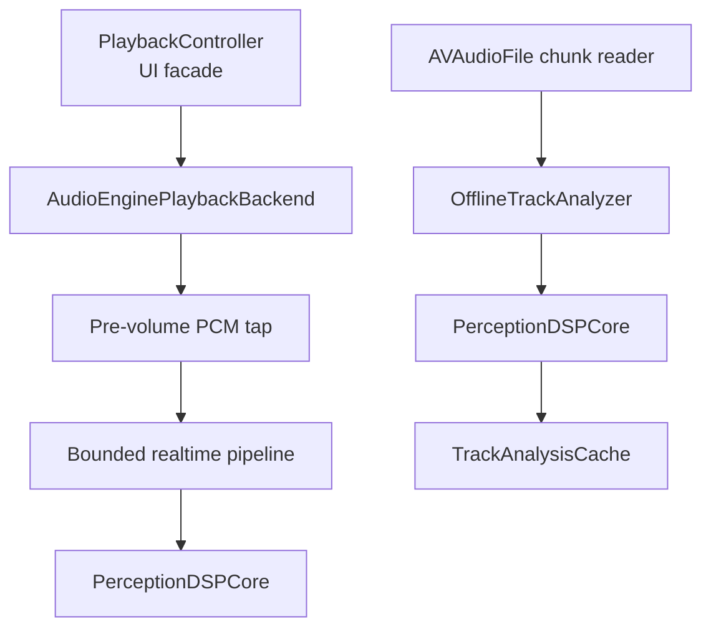

# Step 3「一本の耳」設計仕様

- Status: Design approved (Approach A)
- Written specification review: approved on 2026-07-10
- Approved by: product owner
- Approved on: 2026-07-10
- Base revision: `0d196565db1197f9cb5a9c1a713b1619515e16d6`
- Product source: `docs/PRODUCT_DIRECTION.md` §4.2 / Step 3

## 1. Purpose

Step 3 replaces the current `AVAudioPlayer.averagePower`-only input with one on-device perception engine. The same streaming DSP implementation consumes PCM from live playback and full-file offline analysis, producing loudness, silence, and onset information without changing the audio.

The release is complete when:

1. Playback uses `AVAudioEngine + AVAudioPlayerNode` and exposes a pre-volume output tap.
2. Live and offline paths invoke the same DSP core through the same `consume` / `finalize` interface, using separate state instances.
3. BS.1770 loudness is validated against authoritative EBU material.
4. A versioned per-track analysis cache survives in `library.json` and remains backward compatible.
5. Step 1 playback-trust behavior and Step 2 library behavior do not regress.

## 2. Scope

### In scope

- `AVAudioEngine + AVAudioPlayerNode` transport for local files.
- A live tap that observes decoded PCM before the app volume is applied.
- BS.1770 Integrated plus EBU-compatible Momentary and Short-term loudness measurements.
- Silence state and aggregate silence duration.
- Causal onset detection and aggregate onset statistics.
- Low-priority offline analysis of imported and legacy tracks.
- Optional, versioned analysis data in `AudioTrack`.
- Regression, DSP, persistence, integration, and device verification.

### Out of scope

- Step 4 choreography changes or new yokai behavior.
- Step 5 Producer Check UI, A/B comparison, peak/true-peak display, or corrective suggestions.
- Chorus/section detection, beat-grid estimation, tempo/key estimation, ML classification, or any musical-structure analysis.
- Audio processing, gain changes, normalization, or external upload.
- Persisting every silence range or every onset timestamp in `library.json`.

## 3. Selected dependency strategy

Vendor upstream `jiixyj/libebur128` v1.2.6 at commit `67b33abe1558160ed76ada1322329b0e9e058b02` with its MIT license and copyright notice.

The repository contains a local C static-library target and Clang module map. The app does not depend on a remote package at build time. Only the source required to compile the library, its public header, upstream license, and an origin/version notice are included.

This decision rejects:

- remote Swift wrappers, because the available wrappers are either immature or file-analysis oriented;
- a new Swift implementation of BS.1770, because it would duplicate a standards-sensitive algorithm and enlarge the conformance burden.

The first cache algorithm identifier is `yagyo-perception-v1-libebur128-1.2.6`.

## 4. Architecture



`DSP1` and `DSP2` are independent instances of the same implementation. Mutable meter or detector state is never shared between live and offline work.

### 4.1 PlaybackController

`PlaybackController` remains the `@MainActor` UI facade and preserves its public contract:

- published track, play state, elapsed time, duration, volume, audio level, and playback errors;
- load, play, pause, seek, next, previous, delete-stop, and metadata refresh;
- interruption nesting, route-change privacy behavior, queue context, playback statistics, remote commands, and Now Playing metadata.

It owns policy. It does not own AVAudioEngine graph details or run DSP in a render callback.

### 4.2 AudioPlaybackBackend

Introduce an injectable `AudioPlaybackBackend` protocol. The production implementation, `AudioEnginePlaybackBackend`, owns:

- `AVAudioEngine`, `AVAudioPlayerNode`, a playback-volume mixer, and the loaded `AVAudioFile`;
- frame-based duration and playback position;
- file/segment scheduling, pause, resume, seek, stop, and volume;
- engine start/restart and graph reconstruction;
- schedule completion and engine-configuration events;
- installation/removal of the analysis tap.

The graph is:

```text
AVAudioPlayerNode (volume 1, source-format output tap)
    -> playback-volume mixer (app volume)
    -> main mixer/output
```

The player-to-volume-mixer connection and tap use the loaded file's processing format, preserving mono and labelled multichannel PCM for analysis. Format conversion for the output route occurs downstream. The tap therefore observes source playback independently of the UI volume slider.

### 4.3 Transport correctness

- Duration is `AVAudioFile.length / processingFormat.sampleRate`.
- Position is calculated in seconds across the two rate domains: `scheduledStartFileFrame / fileSampleRate + renderedSampleTime / renderSampleRate`. It is then clamped to the loaded duration. Render samples must never be added directly to source-file frames unless their rates are proven equal.
- Seek clamps to `0...duration`, stops the current schedule, increments a schedule generation, and schedules the remaining segment from the requested frame.
- Load, seek, stop, deletion, and graph reconstruction all increment the generation.
- A `.dataPlayedBack` completion stays constant-time, dispatches control work to the main actor, and may advance the queue only when both track ID and schedule generation still match.
- Pause stores the last confirmed frame. Resume does not reschedule unless the engine lost its schedule.
- Interruption recovery reactivates the audio session, restarts the engine if necessary, and resumes only when the pre-interruption policy allows it.
- `oldDeviceUnavailable` always cancels automatic resume, including when it arrives during an interruption or graph rebuild.
- An engine configuration change rebuilds from the last confirmed frame without bypassing the controller's resume policy.

### 4.4 Realtime boundary

The audio render callback must not:

- mutate `@Published` state;
- perform file or JSON I/O;
- call `libebur128`;
- create a `Task` per buffer;
- wait for the consumer.

It copies PCM into a preallocated single-producer/single-consumer block pool and attempts a nonblocking enqueue. When the bounded queue is full, the incoming analysis block is dropped and a diagnostic counter is incremented. Playback is never delayed for visualization or analysis.

A single serial worker consumes queued blocks. The main actor polls a compact `RealtimeAnalysisSnapshot` at the existing 15 Hz UI cadence.

Every block also carries a stream generation. Load, seek, stop, graph reconstruction, or format change sends an explicit reset before new PCM. If the worker observes a generation change or a noncontiguous `streamStartFrame` (including a dropped block), it resets the live loudness windows, silence state, and onset history rather than synthesizing missing audio. The next snapshot reports the discontinuity and remains unavailable until each window has enough new PCM.

Reset, PCM, end-of-stream, and finalize are generation-tagged commands on the same serial worker. A matching playback completion enqueues an end marker behind that generation's PCM, so finalization cannot overtake already queued tap blocks. Commands from an older generation are discarded.

## 5. Shared DSP contract

### 5.1 Input

`AudioSampleBlock` is a value description of Float32 PCM with:

- sample rate;
- channel count and source channel map;
- frame count;
- monotonically increasing stream start frame in the block's declared sample-rate domain;
- noninterleaved or interleaved storage handled by one adapter layer.

Mono stays mono for loudness analysis. It must not be duplicated to stereo because doing so changes the measured programme loudness.

Version 1 supports mono, stereo, and standard Core Audio 3.0, 4.0, 5.0, 5.1, and 7.1 layouts whose channel labels map unambiguously to libebur128 roles. LFE maps to `EBUR128_UNUSED`. An absent/ambiguous multichannel layout is `unsupported` for standards loudness and offline cache purposes; playback still works, and the live level may still use the decoded channel amplitudes. The implementation must not guess a surround channel order.

The onset branch derives an energy-preserving mono detection signal from the labelled non-LFE channels. This downmix is used only for onset detection; it does not replace the original channel map supplied to libebur128.

### 5.2 Output

The live snapshot contains:

- `level` in `0...1`;
- optional BS.1770/EBU-compatible `momentaryLUFS` and `shortTermLUFS`;
- `isSilent`;
- `onsetStrength` in `0...1`;
- a monotonically increasing onset sequence used to avoid losing a short event between UI polls;
- dropped-analysis-block diagnostics.

The offline result contains:

- measurement status;
- optional Integrated LUFS;
- optional maximum Momentary and Short-term LUFS;
- analysed duration;
- silent duration and ratio;
- onset count and mean onset rate.

No nonfinite floating-point value crosses the DSP boundary or enters JSON. A successful internal `-infinity` result is treated as below the silence threshold, then represented externally by `nil` plus a status.

### 5.3 Loudness

Use libebur128 modes required for Integrated, Momentary, and Short-term loudness. Programme loudness follows ITU-R BS.1770-5 and the corresponding EBU window/gating definitions:

- 400 ms Integrated blocks with 75% overlap;
- `-70 LKFS` absolute gate;
- `-10 LU` relative gate;
- 400 ms Momentary window without gating;
- 3 s Short-term window without gating.

True peak and LRA are deliberately excluded from Step 3. It is therefore not presented as a complete EBU Mode meter. Peak/true-peak work belongs to the Step 5 Producer Check surface and requires its own acceptance work.

### 5.4 Existing visual level

The new PCM path preserves the current visual feel while changing its source:

- calculate per-channel average power and use the maximum channel value, matching the current one-sided-stereo behavior;
- retain the current `-48...0 dB` to `0...1` mapping;
- retain attack coefficient `0.65` and release coefficient `0.18` at the 15 Hz publication cadence;
- publish zero while stopped or when a new track resets analysis.

This keeps Step 3 from silently redesigning Step 4 choreography.

### 5.5 Silence

Silence is a YagyoPlayer detector, not an EBU-standard label.

- Evaluate the EBU-compatible Momentary result on its 100 ms update cadence.
- Enter silence when a valid 400 ms Momentary window is `<= -70 LUFS`.
- Exit silence when Momentary rises above `-65 LUFS`.
- Before a 400 ms result exists, an all-zero sample window may identify silence for short files/pre-roll.
- Offline silent duration is accumulated from the same state transitions used by live analysis.

The 5 LU hysteresis prevents rapid state chatter. Any change to these thresholds requires an analyzer-version bump.

For duration accounting, the first qualifying Momentary window attributes its complete 400 ms interval to silence. Every later qualifying 100 ms hop adds 100 ms; the first exit hop adds nothing. Final duration is clamped to the analysed duration. At finalize, status precedence is `unsupported` first, then `silent` for an entirely silent file (including an all-zero file shorter than 400 ms), then `tooShort` for a non-silent file shorter than 400 ms, otherwise `complete`.

### 5.6 Onset

Implement a causal SuperFlux-style detector independently from the published algorithm description, using Apple Accelerate for FFT operations. Do not copy code from the reference repository.

Version 1 parameters:

- Hann-window STFT;
- FFT size is the nearest power of two to `sampleRate * 0.046`, clamped to `512...8192` samples (2048 at 44.1/48 kHz, 4096 at 88.2/96 kHz, 8192 at 176.4/192 kHz);
- 75% overlap;
- log-compressed magnitudes `L[n,k] = log(1 + 1000 * magnitude[n,k])`;
- normalized positive spectral difference `S[n] = mean_k(max(0, L[n,k] - max(L[n-1,k-3...k+3])))`;
- adaptive threshold from the previous one second only: `T[n] = max(median + 1.5 * MAD, 1e-7)`;
- minimum refractory period of 80 ms;
- strength `clamp((S - T) / max(T, 1e-12), 0, 1)`.

The one-second flux history starts zero-filled. Peak decisions begin once frames `n-2...n` exist. With a one-frame decision delay, frame `n-1` is an onset candidate when `S[n-1] > T[n-1]`, `S[n-1] > S[n-2]`, and `S[n-1] >= S[n]`. Its event time is the centre of frame `n-1`. A candidate is accepted when its event time is at least 80 ms after the last accepted event; equality is accepted. The refractory interval is anchored to accepted events, not rejected candidates.

The STFT grid is anchored to frame zero of each stream generation and maintained by an internal FIFO across `consume` calls. A final partial window is discarded rather than zero-padded. Offline analysis uses no unavailable future frames, so identical PCM and arbitrary chunking produce the same onset sequence as live analysis. Parameter changes require fixture evidence and an analyzer-version bump.

## 6. Offline analysis and persistence

### 6.1 Scheduling

`TrackAnalysisCoordinator` runs serially at utility priority and deduplicates track IDs already queued or in flight.

Analysis is requested:

- after `AudioLibraryStore.load()` for tracks with missing/stale results;
- after a successful import for the newly created tracks.

Import completion and playback never wait for offline analysis. Deleting a track, changing its content hash, cancellation, or app termination makes an in-flight result discardable.

### 6.2 TrackAnalysisCache

Add one optional property to `AudioTrack`:

```swift
var analysis: TrackAnalysisCache?
```

The cache stores:

- `algorithmVersion`;
- `sourceContentHash`;
- `analyzedAt`;
- `status` (`complete`, `silent`, `tooShort`, or `unsupported`);
- finite-or-nil Integrated/max Momentary/max Short-term LUFS;
- analysed duration;
- silent duration and ratio;
- onset count and mean onset rate.

It does not store PCM, waveforms, complete silence ranges, or onset timestamp arrays.

A cache is current only when both `algorithmVersion` and `sourceContentHash` match. Legacy JSON decodes with `analysis == nil`. Legacy tracks without a hash are hashed/backfilled before analysis.

### 6.3 Atomic update behavior

`AudioLibraryStore.updateAnalysis` follows the existing metadata rollback pattern:

1. locate the current track and re-check its content hash;
2. replace the optional cache in memory;
3. save `library.json` atomically;
4. roll back the in-memory cache and surface the existing persistence error path if save fails.

Deterministic results such as silent/too-short/unsupported may be cached. Transient read, cancellation, or storage errors are not cached as successful analysis and can be retried later.

## 7. Error handling

- Playback errors remain user-visible through `playbackErrorMessage`.
- A DSP or offline-analysis failure never stops or modifies playback.
- Realtime queue overflow drops analysis work, not audio work.
- Unsupported/invalid offline input records a bounded status without a localized raw error string in the manifest.
- Persistence failure rolls back the cache update and uses `persistenceErrorMessage`.
- A file removed while queued is skipped without recreating the track.
- All-silent and under-400-ms audio are valid explicit states, not NaN/Infinity errors.

## 8. Test strategy

Implementation follows red-green-refactor. Each layer receives failing tests before production code.

### 8.1 Characterization and controller tests

Before replacing `AVAudioPlayer`, protect:

- load failure, play/pause, volume, clamped seek, previous/next/wrap;
- playlist queue context;
- half-played and finished statistics recorded at most once per load;
- deletion and metadata refresh;
- Now Playing elapsed/rate updates;
- nested interruption behavior;
- `oldDeviceUnavailable` privacy pause and no auto-resume;
- `newDeviceAvailable` no-op behavior.

Use an injected fake backend for deterministic state-machine tests. Keep at least one generated-WAV production-backend integration test.

### 8.2 Transport integration tests

- Generated WAV load/schedule/play/pause/seek/finish.
- Negative and beyond-end seek clamping.
- Stale completion after seek, load, stop, or deletion cannot advance the queue.
- Engine restart/reconstruction retains the confirmed frame and respects resume policy.
- Tap receives the expected number and format of frames during controlled rendering.

### 8.3 DSP tests

- All-zero, constant sine, isolated impulse, repeated impulses, and steady/vibrato-like tones.
- Mono/stereo and one-sided stereo.
- Standard 5.1 with LFE ignored, plus an ambiguous-layout rejection fixture.
- 44.1, 48, 88.2, 96, and 192 kHz.
- Audio shorter than 400 ms and three seconds.
- Chunk boundaries of 64, 257, 1024, 4096, and deterministic random frame counts.
- Equivalent final measurements and event sequence for live simulation and offline input when no realtime blocks are dropped.
- Realtime queue saturation proves nonblocking enqueue and increments the drop diagnostic.
- Every cached double is finite.

### 8.4 Persistence tests

- Cache save/reload.
- Legacy JSON decodes with no analysis.
- Hash/version mismatch schedules reanalysis.
- Save failure rolls back the in-memory cache.
- Deleted/changed track rejects a late result.
- Silent, too-short, and unsupported statuses round-trip.

### 8.5 Standards validation

Use EBU Loudness Test Set v5.0 as an external validation fixture. The 87 MB fixture archive is not committed to the application repository. Record the fixture version/hash, commands, meter settings, expected values, measured values, and result in `docs/AUDIO_ANALYSIS_VALIDATION.md`.

Acceptance:

- required EBU Momentary, Short-term, and Integrated cases are within `±0.1 LU` of their stated values;
- streaming simulation and offline invocation of identical PCM, channel map, and sample rate with zero dropped blocks agree within `1e-9 LU` and yield exactly the same silence/onset aggregates;
- the vendored commit and cache algorithm version appear in the validation record.

Also compare at least ten SHA-identified mono/stereo fixtures or real tracks (quiet, dense, dynamic, leading/trailing silence, and short material) with Youlean Loudness Meter 2 in its documented EBU R128/BS.1770 preset and with FFmpeg's `ebur128` filter as an independently automated cross-check. Record the exact Youlean/FFmpeg versions and settings. Integrated/max Momentary/max Short-term differences must be `<= 0.1 LU` when the reference exposes tenths without intermediate rounding, otherwise `<= 0.2 LU` with the rounding limitation stated.

### 8.6 Platform gates

- Checked-in Xcode project and `project.yml` remain aligned.
- Xcode build and complete unit-test suite pass on the iOS Simulator.
- Generic iOS device build and static analysis pass with signing disabled.
- Real-device checks cover screen lock, Control Center, Bluetooth/AirPods commands, Siri/phone interruption, unplug pause, seek, and background continuation.

The existing `main` Xcode Cloud combined status is `error` despite PR #11 reporting successful local simulator/device validation. Before attributing a failure to Step 3, establish a fresh baseline and distinguish infrastructure failure from a source/build regression.

## 9. Delivery order

1. Characterize current transport behavior and introduce the backend seam.
2. Vendor libebur128 and prove the Swift/C facade with loudness tests.
3. Implement the shared DSP core for loudness, silence, and onset.
4. Implement offline analysis, cache schema, invalidation, and persistence.
5. Implement the AVAudioEngine backend and realtime bounded pipeline.
6. Wire launch/import backfill while preserving the UI contract.
7. Run standards/platform validation and update product documentation.

Each step must leave playback usable and keep its own tests green before the next step starts.

## 10. Authoritative references

- [ITU-R BS.1770-5](https://www.itu.int/dms_pubrec/itu-r/rec/bs/R-REC-BS.1770-5-202311-I%21%21PDF-E.pdf)
- [EBU Tech 3341](https://tech.ebu.ch/docs/tech/tech3341.pdf)
- [EBU Loudness Test Set v5.0](https://tech.ebu.ch/publications/ebu_loudness_test_set)
- [libebur128 upstream](https://github.com/jiixyj/libebur128)
- [AVAudioEngine](https://developer.apple.com/documentation/avfaudio/avaudioengine)
- [AVAudioPlayerNode scheduleSegment](https://developer.apple.com/documentation/avfaudio/avaudioplayernode/schedulesegment(_:startingframe:framecount:at:completioncallbacktype:completionhandler:))
- [AVAudioNode installTap](https://developer.apple.com/documentation/avfaudio/avaudionode/installtap(onbus:buffersize:format:block:))
- [Performing offline audio processing](https://developer.apple.com/documentation/avfaudio/performing-offline-audio-processing)
- [SuperFlux paper](https://www.dafx.de/paper-archive/2013/papers/09.dafx2013_submission_12.pdf)
