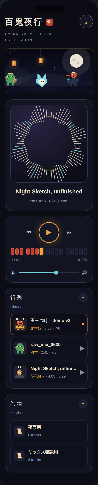
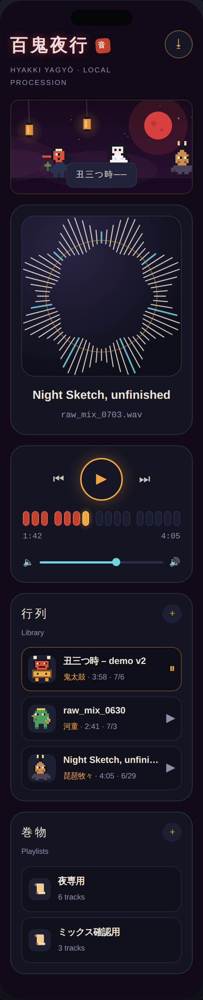
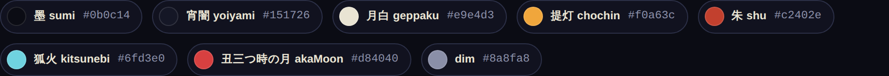
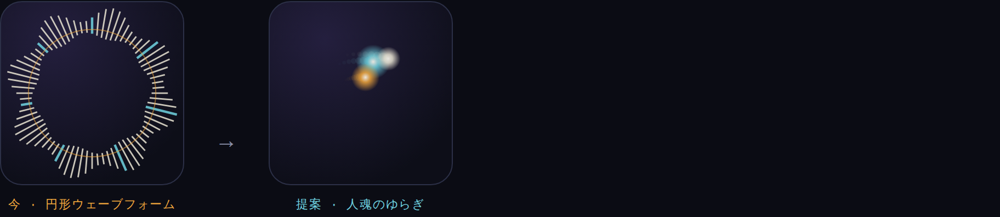
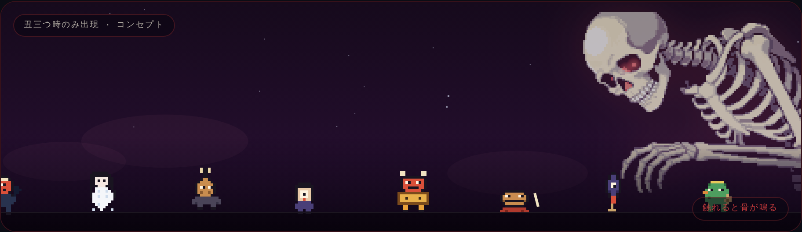
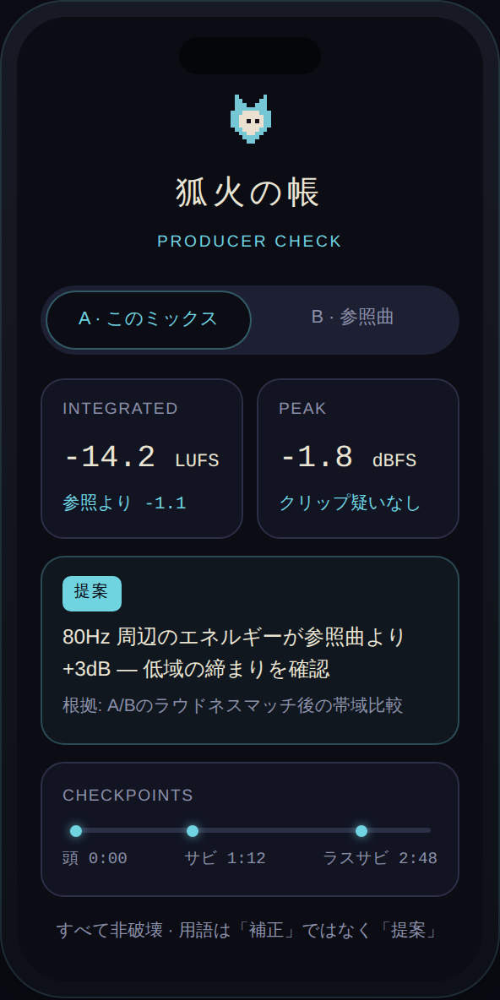

# デザインナビ

`docs/PRODUCT_DIRECTION.md`（v3・作者の憲章）に追従するビジュアル・リファレンス。ロードマップ、原則、非目標の一次情報は憲章を参照し、音量入力と振付の正式な対応は [夜行絵巻 振付翻訳帳](CHOREOGRAPHY.md) を正本とする。

## Step 4 唐傘縦切りの現在地

Step 4 では、毎秒15回(15 Hz周期)で読む `AVAudioPlayer.averagePower` から得る単一の `ParadeSignalSnapshot` を、小さな `ReactiveVisualStage` だけが coordinator から購読する。この wrapper が snapshot を夜行絵巻へ、snapshot の `level / activity / levelBand` を円形波形へ渡し、root `ContentView` やライブラリ全体を 15 Hz 更新へ巻き込まない。snapshot は `level / activity / strongPhase / strongSequence` を持ち、停止、meter 利用不可、`quietProxy`、通常状態を区別する。現在トラックの resident は固定 roster による互換割当を保ったまま先導へ移る。

現在の唐傘は、赤〜珊瑚色の正面円錐形、茶色の頭頂と金帯、中央の一つ目、笑い口と桃色の舌、淡色の一本足、一足の下駄を全8枚で共有する。`.open` は互換性のための内部phase名で、見た目は横へ開いた傘ではなく正面reactionである。Xcode 27.0のgeneric iOS buildに成功し、checked projectをiOS 27のiPhone 17 Pro destinationでfocused QA **11 / 11**、full suite **65 / 65**（いずれもskip 0）まで完了した。座標tapを使わないsemantic AX validationは、iPhone 17 Proのstate matrix **4 / 4**とReduce Motion stability **1 / 1**、最小幅iPhone 17eのdefault Normal + Karakasa **1 / 1**をskip 0で通過した。Reduce Motionの`t0`／`t+2 s` full PNGは同一で、canvas cropのdiffering bytesも0である。最初の17e menu試行失敗とauto diagnostics終了は除外し、follow-up GREENを正本とする。[現在の証跡ledger](evidence/step4-karakasa/README.md)に画像とhashを集約し、2名の独立native reviewerがcontact sheet／GIFとSimulator画像7枚をすべてAPPROVEDした（BLOCKER／MAJOR／MINOR 0）。Pro Strongの右端寄りは切断なしのINFOだけである。binary evidence commit `150219fea8a13ed95ea65885f5e7b46101cff9e5`で9 binary hash、旧5画像削除、画像link、PR本文も確認した。2026-07-12にユーザー本人が唐傘(PR #13)と残り8体(PR #14)の見た目を承認し、Step 4は`main`へ統合済み。旧32件／57件と、紫色・横向き／長い柄・横に開いた唐傘の旧画像はsupersededで、現行の視覚証拠には使わない。行列9体はすべて同じ40×48契約で、混在画風は解消済み。

| 入力・状態 | snapshot と表示 | 現在地 |
|---|---|---|
| stopped | 中立姿勢で移動、揺れ、歩行フレームを停止 | `main`統合済み・現行full suite合格。今回のsemantic image set外 |
| unavailable | 再生は継続するが音量反応は出さず、位相固定・中立色・破線の CircularWaveform と破線の提灯 halo で low / stopped と区別する | `main`統合済み・現行full suite合格。今回のsemantic image set外 |
| level | 通常時は固定 4 fps で歩行し、level を bob の振幅、提灯 halo、Reduce Motion の円形波形の離散形状へ翻訳 | Normal + KarakasaをPro／17eのsemantic AX testと独立native visual QAで確認済み |
| `quietProxy` | 低レベル継続を遅い行進と小さな bob へ翻訳。専用 `hush` は唐傘だけで、他の妖怪は `idle` fallback | Quiet + KarakasaをProのsemantic AX testと独立native visual QAで確認済み |
| `strongRiseProxy` | `anticipate / .open / recover` の一回の反応へ翻訳。`.open` の唐傘は赤い正面reaction | Strong／Strong + Ushimitsu／Strong + Reduce MotionをProのsemantic AX testと独立native visual QAで確認済み |
| resident | 現在トラックの妖怪を重複なく先頭へ移し、先導灯と VoiceOver で示す | Karakasa選択を座標tapなしのsemantic AX testで確認。聴取史による進行は未接続 |
| 丑三つ時 | 一つ目小僧を最後尾へ追加。音量由来の状態ではない | Strong + UshimitsuをProのsemantic AX testと独立native visual QAで確認済み |

判定値、reset 境界、Reduce Motion の静止代替は [CHOREOGRAPHY.md](CHOREOGRAPHY.md) に集約する。歩行周期は画面上の行進テンポで、楽曲の BPM ではない。

## 既存スクリーンショットとインタラクティブ版（Step 4 前の記録）

次の画像は Step 4 より前の画面構成、配色、レイアウトを記録したもの。現在の snapshot 振付、resident 先導、唐傘 40×48 基準体、Reduce Motion の検証証拠ではない。

| Day | 丑三つ時（月タップで遷移） |
|---|---|
|  |  |

[Claude Design のインタラクティブ版](https://claude.ai/code/artifact/aa4981af-47ac-4fb9-a764-751f356d6261) も、Step 4 前のコードを写した**歴史的な設計アーティファクト**である。そこで動く旧来の音量連動アニメーションを、現在コードや Simulator 検証の代わりとして扱わない。Claude アカウント限定のプライベートリンクで、共有許可も別途必要になる。

## 実装現在地、早見表

| 項目 | 正直な現在地 |
|---|---|
| 音量入力 | `averagePower` のみ。正規化・非対称平滑化後の level と、その時間変化から `quietProxy` / `strongRiseProxy` を作る。拍、デジタル無音、BPM、セクション、音楽的意味は判定しない |
| 視覚信号 | 純粋 reducer と表示専用 coordinator を実装し`main`へ統合済み。再生経路と Audio Session は変更しない |
| 行列 | 固定8体 + 丑三つ時だけ一つ目小僧。未使用のぬりかべを完成数に含めない |
| アート | 唐傘基準体（40×48 px・8フレーム）に加え、残り7体と一つ目小僧も[frame matrix 仕様](superpowers/specs/2026-07-12-remaining-yokai-frame-matrix.md)で同じ40×48契約へ描き直し、2026-07-12にPR #14でユーザー本人が見た目を承認。旧8bitアートと3倍表示は撤去。strong 2フレームは唐傘・鬼太鼓・木魚・狐火・天狗のみ、`hush` 専用姿勢は唐傘のみ |
| residency | UUID 由来の安定した割当を維持。現在曲の resident が行列を先導する |
| 再生統計 | `playCount / lastPlayedAt / playHourCounts` は記録・永続化済み。歴史による行列振付には未接続 |
| Accessibility | 夜行絵巻のVoiceOver値と、夜行絵巻・円形波形のReduce Motion代替を実装し`main`へ統合済み。現行full suite合格。semantic AX 1 / 1、`t0`／`t+2 s` full PNG同一、canvas crop差分0、独立native visual QA APPROVED |
| Step 3 | iOS 27 の正式 SDK で Music Understanding / Core AI を再検証できるまで保留。Core AI / DSP は未実装 |

## 唐傘の SNES 相当アート契約

唐傘は、残りの行列妖怪を描く前に寸法と動きの成立を確かめる**基準体**である。

- 元データ: **40×48 px**。1文字=1ドットの行文字列と名前付き限定パレットを正本にする。
- 表示: **2倍の整数倍率（80×96 pt）**。補間は `.none` とし、非整数拡縮でにじませない。
- 造形: 全8枚で正面向きの赤〜珊瑚色の円錐形、茶色の頭頂と金帯、一つ目、笑い口と桃色の舌、淡色の一本足、一足の下駄を共有する。紫、横顔、長い柄、横へ開いた傘や裏面は再導入しない。
- 色: 透明を除き **最大12色**。赤〜珊瑚色を主色に、濃茶、生成り、桃色、淡色の脚、茶／金色で構成する。
- 基準: 全フレームで共通の `anchorX = 20`、`baselineY = 45` を保ち、描画 rect の差で位置を補正しない。
- フレーム: **8枚** — `idle 1 + walk 4 + hush 1 + strong 2`。
- `walk` は視覚上の一定テンポで、曲の周期を表さない。`hush` は `quietProxy`、`strong` は `strongRiseProxy` の静止代替にも使う。内部phase名`.open`は互換性のため残すが、表示は正面reactionである。

確認順序は次で固定する。

1. 唐傘を通常時・丑三つ時、resident 先導、Reduce Motion、狭い iPhone 幅でsemantic AX検証する（Pro 4 + 1、17e 1、すべてGREEN／skip 0で完了）。
2. 保存済みSimulator画像を2名の独立native reviewerがAPPROVED済み。ユーザー本人による見た目の承認も2026-07-12にPR #13で完了。
3. 残り7体と一つ目小僧について、各状態と必要フレームの matrix を[別仕様](superpowers/specs/2026-07-12-remaining-yokai-frame-matrix.md)として提示する（完了）。
4. その matrix に基づく残り8体の制作・構造検証・独立視覚QA・Simulator検収(iOS 26.5)は完了し、2026-07-12にPR #14でユーザー本人が見た目を承認した。[証跡ledger](evidence/step4-remaining-yokai/README.md)を正本とする。

唐傘本体も2026-07-12にPR #13で承認され、Step 4は`main`統合まで完了した。背景用の大判妖怪（例: 125×105 のがしゃどくろ案）の規格を、40×48 の行列規格へ流用しない。

## デザイントークン

`YagyoColor` / `ParadePalette`（`DesignTokens.swift`）からの抜粋。

| 名前 | 用途 | hex |
|---|---|---|
| 墨 sumi | 夜の地 | `#0b0c14` |
| 宵闇 yoiyami | パネル | `#151726` |
| 月白 geppaku | 文字 | `#e9e4d3` |
| 提灯 chochin | アクセント | `#f0a63c` |
| 朱 shu | 通常打 | `#c2402e` |
| 狐火 kitsunebi | ゴースト | `#6fd3e0` |
| 丑三つ時の月 akaMoon | 丑三つ時アクセント | `#d84040` |
| dim | 副次テキスト | `#8a8fa8` |

## 過去の新規提案（未承認・未実装）

以下は 2026-07-08〜10 に制作したコンセプト記録であり、Step 4 唐傘縦切りのスコープでも、現在の実装でもない。音量入力との対応、追加制作、製品への採用は承認されていない。

### 人魂 — アートワークの視線

アートワーク周辺に民話の語彙を持ち込む視覚案。現在の Step 4 には人魂スプライトも専用振付も追加しない。

### がしゃどくろ — 丑三つ時の背景案

歌川国芳「相馬の古内裏」の構図を参照した、125×105 px・限定11色の大判2フレーム案。行列へ加える案ではなく、音量との対応も未承認である。40×48 の行列用契約とは別規格として保管する。

## 狐火の帳コンセプト（未実装）

数値が主役の検聴画面として作成した過去のコンセプト。Step 3 は iOS 27 正式 SDK の再検証まで保留中であり、Core AI / Music Understanding / DSP の実装を示す画像ではない。

---

## 更新履歴

- 2026-07-12: ユーザー本人が唐傘(PR #13)と残り8体(PR #14)の見た目を承認し、Step 4「夜行絵巻 2.0」を`main`へ統合。行列9体の40×48統一・視覚reducer・resident先導・Reduce Motion/VoiceOver代替が正式にmainの現在地となる。
- 2026-07-12: 残り7体+一つ目小僧の frame matrix 仕様と40×48描き直しを follow-up branch へ追加。旧8bitアート・3倍表示・view側のrect変形反応（持ち上げ／squash／flare／バチ別描画）を撤去し、strong を frame-based の anticipate → reaction へ統一。構造検証と独立視覚QAまで完了、Mac側検証とユーザー見た目承認は未完了。
- 2026-07-12: 参照忠実な赤い正面唐傘のcurrent evidence ledgerへ更新。Xcode 27.0 generic build、iOS 27 focused 11 / 11、full 65 / 65、Pro semantic AX 4 + 1、17e 1 / 1（すべてskip 0）と、Reduce Motionの完全同一PNG／crop差分0を反映。2名の独立native visual QAは全9 artifactをAPPROVED、BLOCKER／MAJOR／MINOR 0。GitHub binary evidence commit／9 blob／旧5画像削除／Draft PRを確認済み。ユーザー本人の見た目承認だけが未完了。初期の紫色・横向き／開いた唐傘、旧32件／57件、旧Simulator画像はsuperseded。
- 2026-07-12（初期記録・superseded）: Step 4 唐傘縦切りの snapshot 振付、正式翻訳帳、resident / 統計の現在地、40×48 基準体と承認ゲートへ同期。当時のiPhone 17 Pro・最小幅iPhone 17eのSimulator画像は、後に不採用となった初期唐傘を写した履歴であり、現在候補の証拠には使用しない。
- 2026-07-10: 全妖怪を SNES 相当へ刷新する方向案を記録し、がしゃどくろを 125×105 px・限定11色へ更新。
- 2026-07-09: がしゃどくろ案と当時のインタラクティブ版を更新。
- 2026-07-08: 初版。PRODUCT_DIRECTION.md v3 のデザインイメージと人魂・がしゃどくろ案を追加。
