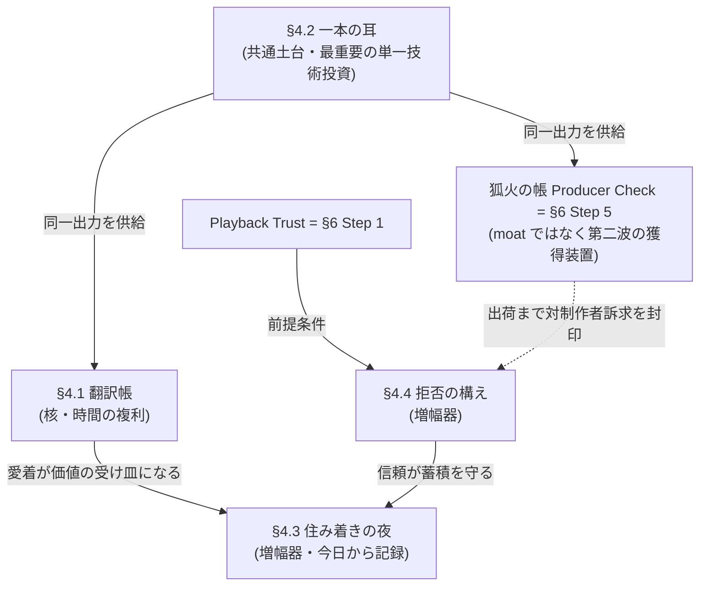

# YagyoPlayer Product Direction v3

この文書は、YagyoPlayer の機能追加・デザイン追加・ロードマップ判断で迷ったときの判断基準です。

**v2 からの最大の変更**: v2 は「何が違うか」を宣言する文書でした。v3 は「なぜ真似されても追いつかれないか」を論証し、その優位がまだ存在しないことを正直に認めた上で、**建設条件と着手順の台帳**として書かれています。すべての差別化機能は 6 ヶ月で複製されると仮定し、それでも残る構造だけを優位性と呼びます。v2 の全文は [docs/archive/PRODUCT_DIRECTION_v2.md](archive/PRODUCT_DIRECTION_v2.md) に保存してあります。

## 0. One-line Positioning

**YagyoPlayer は、自分の音源をローカルに納めると、音に反応する百鬼夜行が目を覚ます iOS 音楽プレイヤーです。**

英語表現:

> A local-first iOS music player where your private audio library becomes a reactive Hyakki Yagyō procession.

約束の言葉(マントラ):

**音を納める。行列が目覚める。聴くたびに、自分の音源が夜に住みつく。**

## 1. North Star

**Press play, and the procession wakes up.**

North Star は次の 3 条件です。各条件に測定可能な代理指標(proxy)を付します。「良くなったか」を議論で決めない。

| 条件 | 意味 | 測定 proxy |
|---|---|---|
| 1. 画面を見なくても、音楽プレイヤーとして信頼できる | 再生の確実性が世界観に優先する | 再生失敗率、バックグラウンド再生セッションの完遂率、クラッシュフリー率 |
| 2. 画面を見ると、音の状態が夜行絵巻として伝わる | 演出は装飾ではなく情報である | 反応の意味が対応表(§4.1 翻訳帳)で説明できる割合、Reduce Motion 時の情報保存 |
| 3. 使い込むほど、自分の音源がこの世界に住み着いていく | 時間が価値に変わる | W4(利用開始 4 週目)リテンション、統計が蓄積したトラック数(residency 深度 — residency はトラック毎の妖怪割当。定義は §4.3)、深夜帯の再生セッション数 |

条件 1 と条件 2 の緊張について: 音楽再生の大半は画面オフで起こる。画面オフの時間は「記録が蓄積する時間」(§4.3)であり、絵巻は画面を開いたときに蓄積が姿を見せる報酬である。画面オフ時の YagyoPlayer を選ぶ理由は条件 1(信頼)と §4.4(拒否の構え)が担う。

## 2. 誰のためか、どの順で獲得するか

オーディエンスは v2 と同じ 3 層だが、**同時に狙わない**。1〜2 人の開発体制で二正面の獲得戦を張ることはできない。

### 第一波: Primary(自分の音源を持つ音楽好き)+ Tertiary(日本的幻想・ドット絵に惹かれるユーザー)

- ローカル音源・デモ・購入音源・録音素材を自分で管理したい人。
- 世界観と craft(§4.1)が獲得チャネル。App Store のスクリーンショットと口コミで伝わるのはこちら。
- この層への約束: **聴き込むほど、あなたの夜だけが深くなる。**

### 第二波: Secondary(音楽制作者・サウンドクリエイター)

- 「一本の耳」(§4.2)が出荷され、数値の信頼が公開検証された**後**に取りに行く。
- 獲得フックは実在する不便の置換: 「DAW からバウンス → AirDrop → Files で再生 → 車で確認」という現行ワークフローを「AirDrop → 夜行で開く」に一手順で置き換える。
- 音を触らない実績のないアプリを制作者は信用しない。信頼の実績(§4.4)が先、訴求が後。

## 3. 2026 年の市場と空白

市場は「無料ユーティリティ(foobar2000 mobile)」「買い切り良品(Doppler)」「フリーミアム多機能(Flacbox/Evermusic)」「サブスク演出(Plexamp/CassoFlow)」に分化している。以下は 2026 年 7 月時点の調査(上記 4 分類の主要アプリが範囲)で確認できなかった空白であり、悉皆調査ではない:

- **空白 1 — 取込の信頼性 UX。** 取込結果レポート・重複検出を備える iOS ローカルプレイヤーは調査範囲で確認できなかった。Doppler のタグ編集+アルバム統合が最高水準で、その先が空いている。
- **空白 2 — 世界観演出 × 本格ローカル管理の統合。** 演出系(CassoFlow 等)は管理機能が皆無、ローカル強者(foobar2000/Flacbox)は無味乾燥。両立するアプリは確認できなかった。
- **空白 3 — 検聴(ミックス/マスターの確認試聴)の一画面プレイヤー。** LUFS メーター(Youlean)、モノ折りたたみ(FOLD、2026 年 6 月登場)、A/B(MIXvs 等)は単機能アプリとして乱立し始めたが、ファイルを開けば検聴に必要な情報が一画面に揃うプレイヤーは確認できなかった。**非破壊・根拠付き提案も同様の空白**(クラウド勢は黙って処理を適用する側)。単機能アプリの乱立は、統合が時間の問題である兆候でもある — この空白には賞味期限がある。
- **空白 4 — 「誠実な買い切りローカル」の椅子。** VOX はサブスク不信でレビュー炎上、Plexamp は前提の Plex Pass が Lifetime $750 へ値上げ、Doppler は買い切り哲学で支持されるが更新停滞が指摘される。
- **警戒事項**: Apple の `MusicUnderstanding.framework` が loudness / 構造解析を OS 標準で提供すれば、**検出層はコモディティ化する**。守るべきは検出ではなく翻訳(§4.1、§4.2)。

## 4. 永続的優位の台帳(Moat Ledger)

**前提の正直な宣言: 現時点で YagyoPlayer に moat(堀 — 模倣されても残る構造的優位。以後 moat と表記)は存在しない。** 以下の 4 つは「保有資産」ではなく「建設中の優位の仮説」であり、各仮説には (a) 主張、(b) 複製テスト(資金のある競合が 6 ヶ月で複製を試みたら何が残るか)、(c) 現在地の正直な評価、(d) 建設条件を付す。建設条件を満たさないまま優位を主張することを、この文書は禁止する。

### 4.1 翻訳帳 — 作家性マッピング・コーパス

**主張**: 防御資産は妖怪の絵でも数でもなく、**「どの音響事象を、どの妖怪の、どの挙動に訳すか」という翻訳判断の蓄積**である。例: 提灯の火はアタックが速くリリースが遅い(実装済み)。唐傘は強打でのみ開く(音量閾値による近似で実装済み — 真のオンセット検出は §4.2 の後)。丑三つ時は時刻そのものを操作系にする(実装済み)。この種の小さな判断を単一の作家の一貫した taste で積み上げた体系が核であり、ユーザーには「反応が読める」(legibility)として知覚される — 唐傘が強打でだけ開くことに気づいた夜、演出は情報になる。

**複製テスト**: 競合はピクセルアーティストを雇い 3 ヶ月で妖怪風スキン+汎用ビジュアライザを出せる(そのカテゴリは CassoFlow や jetAudio 別売ビジュアライザとして既に存在し、脅威ではない)。個別の判断は画面から観察可能でコピーできる。**コピーできないのは判断同士が相互依存する体系の密度と、単一作家の一貫性**(著作権は個々のスプライトの直接流用を防ぐだけで、体系の複製は防がない)。大手は分業する傾向が強く、その場合翻訳判断は会議の産物になり均質化しやすい — 単一ディレクター制を敷かれた場合、この防御が薄まることは認める。

**現在地(正直に)**: コーパスはほぼゼロ。音響側の語彙は音量 1 語(`averagePower`)しかなく、妖怪の跳ねは固定サイン波×音量の疑似ビート。翻訳判断の実例は提灯の非対称スムージング等、数件。スプライトは行列 8 体+条件出現の一つ目小僧+未使用のぬりかべ(計 10 体)、フレームは歩き 2 枚(木魚は同一絵の複製で実質 1 枚)+hit 2 体分と薄い。**器(データ駆動のスプライト生成系)は完成、中身はこれから。**

**建設条件**:
1. 音響語彙の拡張が前提(§4.2 が先行依存)。オンセット・無音・帯域エネルギーが「原語」に加わって初めて翻訳帳が書ける。
2. スプライトの状態機械化(idle / walk / hit / lurk)と、妖怪の頭数ではなく**一体あたりの挙動深度**への投資。
3. **翻訳帳を公開文書として管理する**(`docs/CHOREOGRAPHY.md`、音響事象→挙動の対応表)。公開の第一目的はユーザーへの「反応の意味の説明」(North Star 条件 2)であり、後追いの複製を剽窃の自白に変える抑止効果は副次的なものと位置づける。
4. AI 支援でアセットを量産する場合も、最終判断は単一の作家の taste で統一する。一貫性が消えれば差別化根拠自体が消える。

**測定**: 翻訳帳の項目数とその月次成長。対応表で説明できる反応の割合。

### 4.2 一本の耳・二つの顔 — 単一知覚エンジン

**主張**: オンデバイス音響解析(ラウドネス・無音・オンセット)を**一本だけ**作り、同じ出力をリスナー向け「曲を読む行列」と制作者向け「狐火の根拠付き助言」の両方に食わせる。この制作者向け検聴画面の正式名は**狐火の帳(Producer Check)**とする — 以後 Producer Check と表記し、「検聴」は行為を指す一般語として使う。これは厳密には moat ではなく**設計判断**である — しかし 1〜2 人で「演出×管理の二正面問題」(§3 空白 2)を張れる唯一の方法であり、体験レベルまで融合すれば「エンジンを複製しても、体験を複製するには世界ごと複製する必要がある」状態を作れる。

**複製テスト**: 解析技術そのものは公開仕様(ITU-R BS.1770 / EBU R128)+ OSS(libebur128、aubio 等)の組合せで、資金のある競合なら 6 ヶ月で複製可能。実用系競合が LUFS メーターを載せても世界観がなく(Youlean と同じ棚に並ぶだけ)、演出系競合が数値を載せても制作者の信頼がない。既存勢は自社の収益構造(Plexamp のサーバー必須、Everappz の機能分割 IAP)がフルコピーを禁じる。**残る脅威は三つ: (a) 資金付き新規参入、(b) 単機能検聴アプリのプレイヤー化(空白 3 の賞味期限の主因 — この面では世界観は防御にならず、既存の数値信頼を持つ実用系が有利)、(c) 同じ哲学の新インディー(§4.4)。いずれへの防御も、先に出荷することと、出荷後に蓄積(トラック毎の解析キャッシュ+履歴)で時計をリセットさせないことしかない。構築率 0% の優位に時間差は存在しない — 出荷速度が全て(この要請と建設順序の調停は §6 冒頭)。**

**現在地(正直に)**: 解析はゼロ。音声入力は `AVAudioPlayer.averagePower` 1 本のみ。

**建設条件**:
1. **スコープの縮小定義**: v1 の知覚エンジンはラウドネス(BS.1770 準拠 LUFS)+無音+オンセットに限定する。**楽曲構成解析(サビ検出等)は v1 の非目標**(MIR でも未解決に近い難題であり、「単一の技術投資」の主張は縮小後にのみ成立する)。
2. AVAudioEngine + tap へ移行し、リアルタイム系(絵巻)と全曲オフライン系(検聴・重複検出)を**共有 DSP コアの二呼び出し**として設計する。
3. 車輪を再発明しない。libebur128 等の実績ある OSS を使い、唯一の資源である時間差を守る。
4. **数値の信頼を公開検証する**: LUFS 値を業界標準メーター(Youlean 等)と突合した結果を公開する。「音を触らない実績のないスキンアプリ」という不信は、まず自分が乗り越える。
5. `MusicUnderstanding.framework` の提供範囲を確認し、コモディティ化される層(検出)と自前で守る層(根拠付き助言・世界観への翻訳)を分離しておく。検出層は将来 OS 標準に乗り換えられる設計にする。

**測定**: tap 系とオフライン系のコード共有率。標準メーターとの誤差公開。トラック毎解析キャッシュの蓄積数。

### 4.3 住み着きの夜 — 体験された時間の不可搬性

**主張**: residency(トラック毎の妖怪割当)に再生統計(playCount / lastPlayedAt / 聴いた時間帯)を永続化し、行列の状態をユーザーの聴取史の関数にする。ただし moat の源泉は**データの不可搬性ではない** — エクスポート自由の原則を守る限り、統計データは定義上持ち出せる。**持ち出せないのは「この鬼太鼓と過ごした 8 ヶ月の夜」という意味と習慣**であり、価値は妖怪という著作物への愛着(§4.1)に流れ込む。データの人質はとらない。愛着で残ってもらう。

**複製テスト**: 競合は「聴くほど育つビジュアライザ」を 6 ヶ月で出せるし、scrobble データ等で新規ユーザーの「数字」をシードできる。それでも、**初日から数字がある競合と、初日から意味がある YagyoPlayer は別物**である。この moat の強さは既存ユーザー数×在住期間に厳密に比例するため、ユーザーがいない間は価値ゼロ — 単独では弱い増幅器であることを認め、§4.1 と §4.4 に束ねて初めて機能する。

**現在地(正直に)**: residency は UUID ハッシュ 4 行のみ。統計はゼロ。sprite 割当の使用箇所はライブラリ行のサムネイル 1 箇所で、**夜行絵巻本体は residency と未接続の固定 8 体隊列**。「行列と聴取史の接続」は完全な新規工事。

**建設条件**:
1. **記録は今日から、演出は後から。** 統計スキーマ(playCount / lastPlayedAt / 時間帯ヒストグラム / notes)の追加と再生イベントでの更新・永続化は、optional フィールドで後方互換に行える数日規模の工事であり、蓄積は始めた日から複利で効く。演出の高度化を待つ理由がない。
2. 絵巻と residency の実接続(どの妖怪が現れるか、提灯の色、丑三つ時の特別挙動)。新規ドット絵制作を最小化し、既存 10 体(行列 8+一つ目小僧+未使用のぬりかべ)の再利用で知覚可能な変化を設計する。
3. **蓄積が端末喪失を生き延びること**: iCloud バックアップで `Documents` の統計が復元されることを確認する。消える資産は愛着の裏切りであり、§4.4 を毀損する。
4. 収集ゲーム化への線引きを守る(§7)。

**測定**: residency 深度(統計を持つトラック数)。W4 リテンション。深夜帯セッション数。

### 4.4 拒否の構え — 検証可能な三ヶ条と買い切り

**主張**: 「**音を勝手に変えない・どこにも送らない・買い切りで売る**」の三ヶ条を、美学ではなく事業構造として運用する。サブスク収益(VOX/Plexamp)やクラウド処理(LANDR/BandLab — アップロードが事業そのもの)を収益源とする既存勢は、この構造を採ると自社収益を破壊する(Counter-Positioning)。非送信=サーバー費ゼロは買い切り経済と整合し、1〜2 人体制の持続可能性そのものでもある。

**複製テスト**: 宣言のコピーは自由であり、同じ哲学の新インディーには複製される。信頼の記録は年数でしか積めず、**現在の記録はゼロ年**。「誠実な買い切りローカル」の椅子(空白 4)は Doppler が部分的に占有している。したがって:
- 信頼を年数に頼らず、**検証可能性に投資する**: 通信コードを持たないことの証明(iOS には外向き通信を封じる権限や entitlement が存在しないため「権限がない」は証明にならない — 自前コードと依存ライブラリに通信経路が存在しないことのコード監査と、プロキシ監視下での実測ゼロ通信テストで示し、**第三者が再現できる検証手順として公開する**)、プライバシーマニフェストと「データ収集なし」ラベル(自己申告である限界は明記する)、価格方針の公開。
- Doppler とは哲学の同一性ではなく**機能(重複検出・取込レポート・信頼性 UX)と更新頻度**で差別化する。Doppler の停滞は反面教師 — 買い切りの持続計画(将来の大型拡張は有償メジャーアップグレード)を先に設計する。
- 制作者向けの対クラウド訴求(「黙って直す側 vs 根拠を示して提案する側」)は、**Producer Check 出荷まで封印する**。看板が実装に先行してはならない。

**現在地(正直に)**: 現状のコードはこの看板に未達である。割り込み・ルート変更の監視なし、再生失敗は無言で停止、削除確認なし、同一ファイルの無限重複取込が可能。**Playback Trust(§6 Step 1)がこの moat の前提条件であり、満たすまで三ヶ条を対外的な訴求に使わない。**

**建設条件**: §6 Step 0–1 の完了。非送信の技術的証明。価格方針の文書化。

**測定**: 再生失敗の可視化率(無言の失敗ゼロ)。プライバシーラベルの検証可能性。価格・方針変更履歴の公開。

### 4.5 依存構造 — どれが核で、どれが増幅器か

- **核は §4.1 × §4.2**: 翻訳帳は耳がなければ書けず、耳は翻訳帳がなければただの DSP。
- **§4.3 と §4.4 は増幅器**: 単独では破られるが、核の価値を時間で深め、信頼で守る。
- ただし着工順は依存順と異なる: §4.3 の統計記録だけは数日規模で今日から始められ、始めた日から複利が動く(§6 Step 0)。

## 5. 不変の原則(Pillars)

機能ではなく、すべての機能が従う制約。v2 の 5 本柱を統合し、判断に使える形に圧縮した。

1. **Local-first Trust** — 音源はユーザーのもの。取込はアプリ内コピー、結果・失敗・保存場所を明示、外部送信はしない。エクスポートはいつでも自由(データの人質をとらない — Bear 型の信頼)。
2. **Music Made Visible** — 妖怪・提灯・月は音量・拍・状態を伝える存在。意味のない常時アニメーションより、音楽と操作に結びついた反応。すべての反応は翻訳帳(§4.1)で説明できること。
3. **Folklore as Interaction Model** — 行列=ライブラリ、巻物=プレイリスト、提灯=再生位置と音の反応、狐火=分析・提案、丑三つ時=時刻と特別状態。語彙は雰囲気語ではなく操作体系。新機能はまずこの語彙表のどれで呼ばれるかを問う(§8 Q0)。
4. **Producer-grade Restraint** — 音を勝手に加工しない。分析は根拠・比較・取り消しとセット。用語は「補正」ではなく**「提案」**に統一する(自動で直さない、根拠を示して提案し、ユーザーが判断する)。
5. **iOS-native Ritual** — MediaPlayer / App Intents / Shortcuts の作法に従う。VoiceOver・Reduce Motion・コントラストは最初から設計対象。Reduce Motion でも情報が失われない(静止状態でも音量・再生状態の代替表現を持つ)。現在地: reduceMotion 対応は夜行絵巻のみで、波形リング等は未対応 — Step 4 までに揃える。

**Producer Check と世界観の共存規則**(v2 で未定義だった緊張の解消): Producer Check 中、夜行絵巻は静的な背景に退き、数値が主役になる。ただし助言の語彙は狐火で統一する。世界観は検聴の邪魔をせず、検聴は世界観の外に出ない。

## 6. 建設順序

v2 の「Next 3 本並列」を廃し、**依存関係と §8 の優先順位に基づく直列+小工事の先行着工**に改める(Step 2 の位置は依存ではなく優先順位の帰結)。§4.2 の「出荷速度が全て」との調停として、Step 2 は最小コアに絞り、残りは Step 3 と並行の継続工事とする — 空白 3(§3)の賞味期限を、ライブラリ機能の完成度で使い潰さない。

### Step 0 — 即日着工の小工事(数日規模・順不同)

蓄積の時計を今日から動かし、実在するバグを塞ぐ。

- **統計の記録開始**: `AudioTrack` に playCount / lastPlayedAt / 時間帯 / notes を optional で追加し(`library.json` 後方互換)、**定義した再生イベント(例: 半分以上の再生または完走)で統計を更新・永続化する書き込み経路まで**を含める。スキーマ追加だけでは時計は動かない。→ §4.3 の複利が始まる
- **SHA-256 取込ハッシュ**: 現行の `uniqueFilename` は同一ファイルを無限に重複取込できる。ハッシュ導入は (1) このバグの修正、(2) 重複検出、(3) 将来のバージョン束(同曲の v1/v2/master 候補)、(4) バージョン束を将来の A/B 比較ペアの候補にする土台(ラウドネスマッチ自体は Step 3 の LUFS が前提)— 四つの成果を一度の小工事で得る
- **取込結果の表示**: 成功数は既にモデル(`ImportState`)にあるが UI に出ていない。失敗数は未集計(非対応ファイルは黙って読み飛ばされ、途中エラーは成功分ごと failed に潰れる)なので、表示に加えて失敗の個別集計という小さなモデル工事を含む。それでも空白 1(§3)への第一歩になる
- **削除確認**: 何が消えるか(アプリ内コピーのみ、元ファイルに影響なし)を明示

### Step 1 — Playback Trust(§4.4 の前提条件)

目的: 画面を閉じても普通の音楽プレイヤーとして信用できる(三ヶ条の対外訴求の封印については §4.4 現在地)。

Release criteria:
- AVAudioSession の割り込み(電話・Siri)から適切に復帰する(中断前に再生中だった場合のみ再開する)。
- イヤホンが抜かれたら(ルート変更 `oldDeviceUnavailable`)再生を**一時停止**して UI を更新する。スピーカーで自動継続しない — Apple のルート変更ガイダンスに従い、私的な音源を意図せず外に出さないこと自体が §4.4 の信頼である。
- ファイル欠落・読み込み失敗が無言で止まらず、ユーザーに伝わる。
- Lock Screen / Control Center / Bluetooth / AirPods 操作が安定して動く。
- シーク、次曲、前曲、音量、再開が壊れない。

### Step 2 — Library Confidence(最小コア)

目的: 「取り込む・消す」に不安がない。空白 1(§3)を機能で埋め始める。§4.2 の出荷速度要請(空白 3 の賞味期限)のため、このステップは意図的に薄い。

Release criteria(最小コア):
- 重複検出(Step 0 のハッシュ基盤の上に UI を載せる)。
- 空状態・失敗状態・長いライブラリで迷わない。

継続工事(Step 3 以降と並行して進める — Step 3 を待たせない):
- 検索・並び替え(追加日、タイトル、長さ、巻物。**妖怪起点の並び替えは作らない** — §7 の線引き)。
- メタデータ編集(title / artist / artwork / notes)。

### Step 3 — 一本の耳 v1(§4.2)

目的: 知覚エンジンの出荷。スコープは §4.2 建設条件 1 の縮小定義(ラウドネス+無音+オンセット)に従う。

Release criteria:
- AVAudioEngine + tap 移行、共有 DSP コア(リアルタイム/オフライン二呼び出し)。
- BS.1770 準拠 LUFS の標準メーター突合結果を公開。
- トラック毎の解析キャッシュが `library.json` に蓄積される。

### Step 4 — 夜行絵巻 2.0(§4.1 の運用開始)

目的: 音反応が「見た目」から「曲を読んでいる」へ。翻訳帳の複利が始まる。

Release criteria:
- 音量だけでなくアタック・無音・盛り上がりに反応する(木魚・天狗・唐傘は強い瞬間に、無音で行列が息を潜める)。
- `docs/CHOREOGRAPHY.md`(翻訳帳)の公開と運用開始。
- 絵巻と residency の実接続(§4.3 の演出面)。
- Reduce Motion でも情報が失われない。

### Step 5 — 狐火の帳(Producer Check)

目的: 「iPhone で軽く検聴するならこれ」。第二波(§2)の獲得装置。

Release criteria:
- 一画面検聴: LUFS / Peak / クリップ疑い / モノ互換。
- A/B 参照(ラウドネスマッチ付き — 単機能競合が未搭載の中核価値)。
- チェックポイント(先頭・サビ・ラスサビ等の時刻付きメモ)。
- 共有シート/「このAppで開く」/AirDrop からの直接取込(ファイルピッカーを経由しない一手順の導線 — §2 第二波の獲得フックの実装)。
- すべて非破壊。すべての提案に根拠(「80Hz 周辺のエネルギーが参照曲より +3dB」)。
- Producer Check と世界観の共存規則(§5)に従う。

### Later — MusicKit / Apple Music / MusicUnderstanding

- Apple Music 連携は opt-in。認可が必要な理由を明示。ローカルファイル体験を置き換えない。
- `MusicUnderstanding.framework` が検出層を提供したら乗り換えを検討する(自前で守るのは翻訳層 — §4.2 建設条件 5)。

## 7. Non-goals

- 汎用ストリーミングプレイヤーになること。
- SNS、ランキングを主軸にすること。
- **収集ゲーム化しないことの線引き基準**(v2 で曖昧だったものを明文化): 図鑑を作らない。達成率を出さない。「入手」の概念を作らない。住み着きの表示はトラック起点のみ許す(トラック→妖怪の表示は可)。**妖怪起点の逆引き — 妖怪→トラック一覧、妖怪別の並び替え、「全 N 体中 M 体」のような網羅表示 — は作らない。** residency の変化は行列の中で観察されるだけ。この線を越える機能は、どれほど魅力的でも作らない — 大手が得意な報酬設計競争の土俵に乗らないことが防御である。
- 妖怪の頭数を増やすこと自体を目的にすること(投資は一体あたりの挙動深度へ — §4.1)。
- DAW、マスタリングスイート、VJ ツールになること(楽曲構成解析の非目標は §4.2 建設条件 1)。
- Apple Music や AI を初期体験の必須条件にすること。
- 音源をユーザーの明確な同意なく外部送信すること。
- 他社 API・他社サーバーの上に核となる体験を築くこと(Apollo / Tweetbot の教訓: 借地は moat にならない)。

## 8. Decision Rubric

新機能は実装前に次の問いを通す。

**Q0(語彙ゲート)**: この機能は語彙表(行列・巻物・提灯・狐火・丑三つ時)のどの語で呼ばれるか。呼べないなら、それは世界観の外の標準 UI として作るか、作らない。

**ゲート(すべて Yes であること)**:
1. 再生・管理・知覚(分析)・演出のどれかを明確によくするか。
2. ローカルファイル体験と三ヶ条(§4.4)を弱めないか。
3. 音楽制作者が見ても信頼できる挙動か(自動変更ではなく、根拠・確認・取り消し・比較があるか)。
4. iOS 標準操作、アクセシビリティ、バックグラウンド再生と矛盾しないか。
5. 収集ゲームの線(§7)を越えないか。

**優先順位(ゲートを通った機能同士が競合したとき、辞書式に上位が勝つ)**:

> 再生の信頼 > ライブラリの信頼 > 知覚(解析基盤) > 演出の深さ > 新機能

**分類規則**: 機能は「完成した日にユーザーが新しくできること」で分類する。解析値を新たに算出するものは「知覚」。算出済みの値を見せる・比べる UI は、それが載る画面の主目的(再生/ライブラリ/演出)に従う。どれでもなければ「新機能」— Producer Check の各機能は知覚ではなく新機能に分類する(解析基盤は Step 3 で完了済みとみなす)。

**Tie-breaker(順に適用)**:
1. 蓄積を今日から始められる方(記録は今日から、演出は後から — §4.3)。
2. §6 で先の Step に属する方。
3. 実装が小さい方。

## 9. Quality Bar(要約)

- **Playback**: 再生・停止・シーク・次曲・前曲が安定。画面を閉じても操作できる。失敗が無言で起きない。
- **Library**: 取り込んだ音源の場所を説明できる。削除が何を消すか説明できる。重複と失敗がユーザーに伝わる。
- **Visual**: 画面を見ると YagyoPlayer で聴く理由が一瞬で伝わる。反応の意味が翻訳帳で説明できる。ピクセルアートはにじませない。
- **Accessibility**: VoiceOver で主要操作が理解できる。Reduce Motion でも情報が失われない。色だけに依存しない。

## 10. 附録: v2 からの主な変更

| 変更 | 理由 |
|---|---|
| 「Moat Ledger」章(§4)を新設し、全優位性に複製テスト・現在地・建設条件を付した | v2 の差別化表は「現時点で違うこと」の列挙で、模倣後に残る構造の論証がなかった |
| 全 moat を「保有資産」ではなく「建設中の仮説」と宣言 | 敵対的検証の結果、現時点で成立している moat はゼロと判定された。誇大は信頼(§4.4)を毀損する |
| Roadmap の「Next 3 本並列」を依存順の直列+ Step 0 先行着工に変更 | 4 つの独立した戦略分析が「Playback Trust 最優先」「AVAudioEngine+tap が単一最重要投資」「統計記録の先行着工」で完全に収斂した |
| North Star に測定 proxy を追加 | 「住み着いていく」等の詩的条件は判断に使えない |
| オーディエンスに獲得順(第一波/第二波)を導入 | 1〜2 人体制で二正面の獲得戦は張れない |
| 収集ゲーム化の線引き、Producer Check と世界観の共存規則、「補正→提案」の用語統一を明文化 | v2 の内部矛盾(非目標 vs residency、Secondary vs 世界観、rubric vs pillars)の解消 |
| Rubric に Q0(語彙ゲート)・辞書式優先順位・tie-breaker を導入 | v2 の 6 問はほぼ全機能が通過し、フィルタとして機能しなかった |
| v2 §10(README Snippet)を削除 | マーケティング資産は README 本体で管理する |
