# モダンレトロ Day UI — 実描画証跡

- 日付: 2026-07-13
- 対象: 夜行、行列、巻物、ミニ灯り、狐火の帳、円形波形
- 状態: コンセプトと配色配分はユーザー承認済み。実装と自動検証はgreen。実機描画の最終ユーザー確認待ち
- 仕様: [モダンレトロUI設計](../../superpowers/specs/2026-07-13-modern-retro-ui-design.md)

## 実装候補

| iPhone 17 Pro / Day | 行列 | 巻物 |
|---|---|---|
| 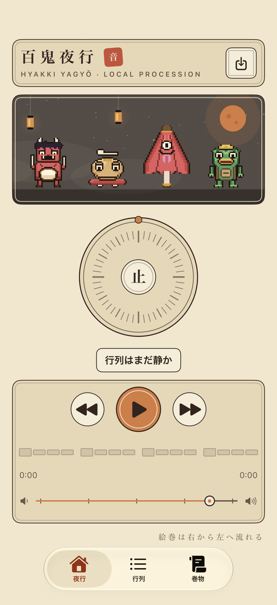 | 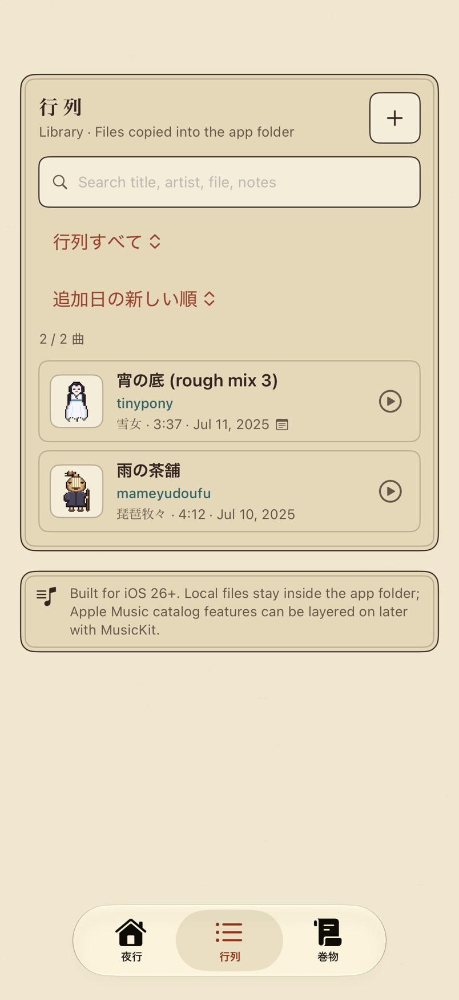 | 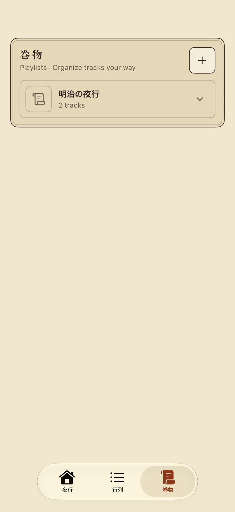 |

| iPhone 17 Pro / 丑三つ時 | ミニ灯り |
|---|---|
| 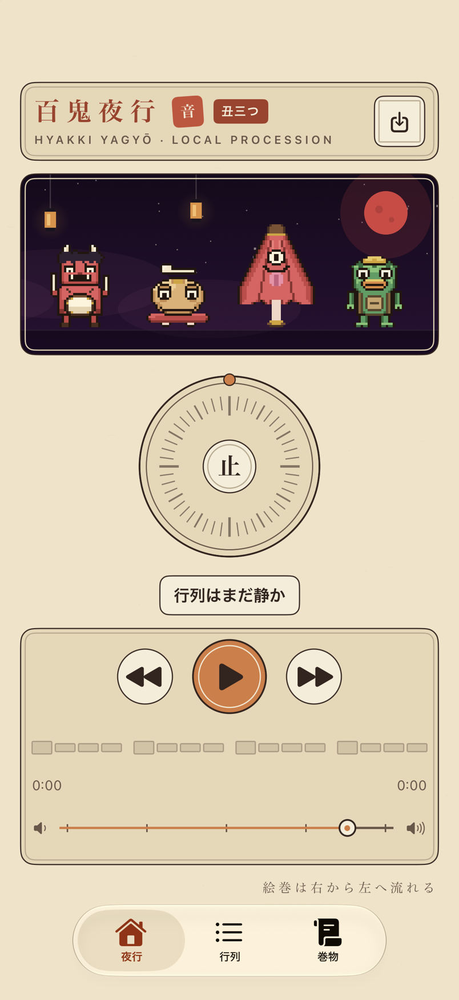 | 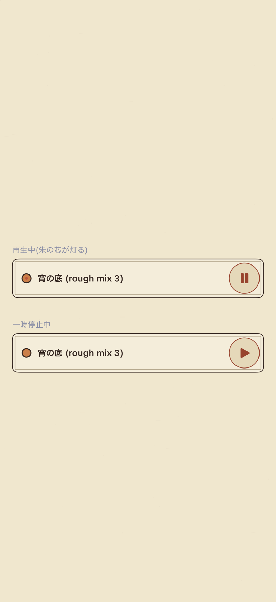 |

| iPhone 17e / Day | 行列 | 巻物 |
|---|---|---|
| 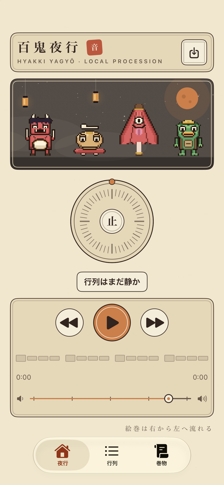 | 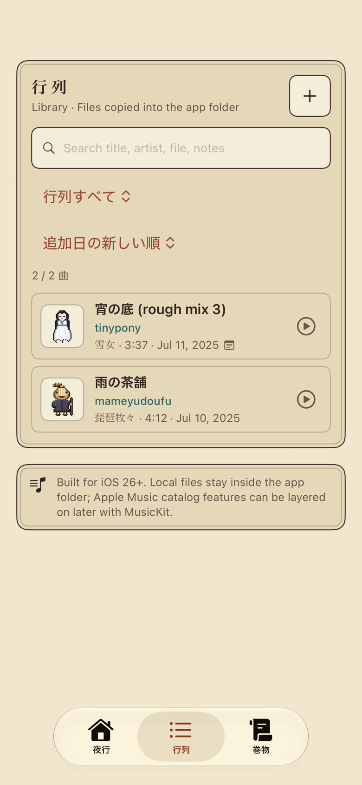 | 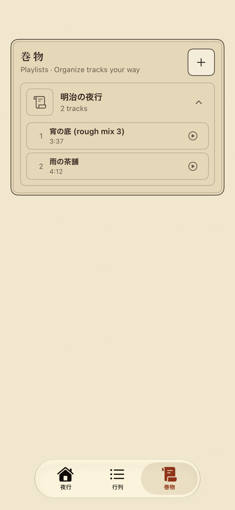 |

| 円形波形の状態 | 狐火の帳 | Accessibility Large |
|---|---|---|
| 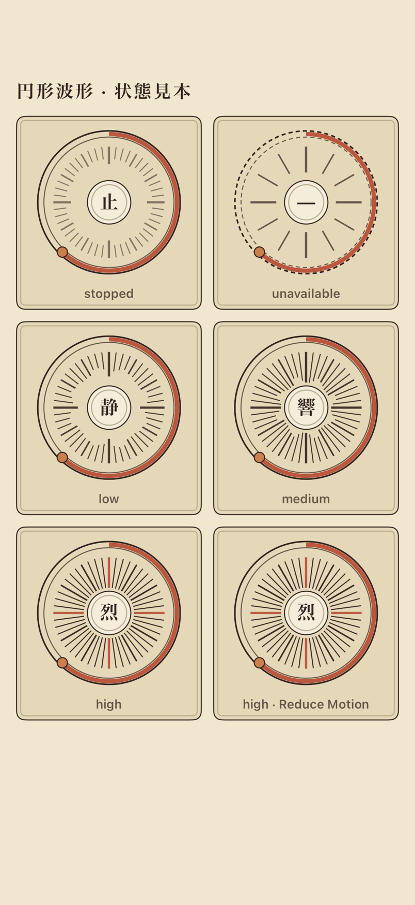 | 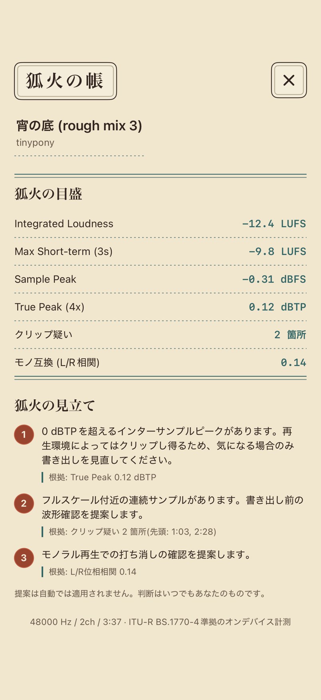 | 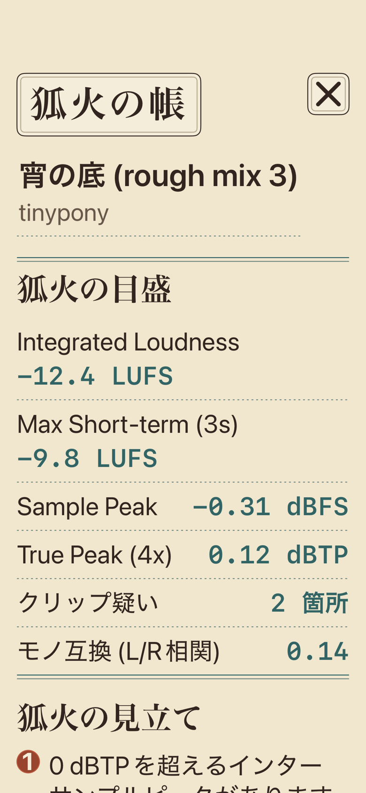 |

[夜行のAccessibility Large](yagyo-accessibility-large.png)では、固定一画面契約を解除して縦ScrollViewへfallbackし、内容を切り捨てない。
[行列のAccessibility Large](gyoretsu-accessibility-large.png)では、絞り込みと並び替えを縦2段へfallbackし、横方向へはみ出さない。

## 目視結果

- 通常面は生成り紙、焦茶の文字と罫を基本とし、濃紺の大面積面を撤去した。
- 百鬼夜行だけを温かい焦茶舞台へ残し、丑三つ時も紙面全体は暗転させない。
- 朱・柿は選択、主操作、再生位置、提案番号へ限定した。青緑は狐火の分析値と細い区切り罫だけに限定した。
- 円形波形は `止 / — / 静 / 響 / 烈`、放射罫、破線外輪で状態を色以外でも区別する。
- 狐火の帳は入れ子カードを撤去し、一枚紙の開いた台帳としてmetricと根拠を読める。
- iPhone 17eの標準文字サイズで、絵巻、円盤、再生操作、灯芯、native tab barが同時に収まる。
- iPhone 17eの巻物は2曲を展開し、行順、曲名、長さ、再生操作が収まることを確認した。
- native tab barは、タイトル順、可視ボタン数、各ボタン領域の実画素をassertして3項目表示を確認した。

## 自動検証

すべてのDerivedData、`xcresult`、一時ファイルは外付けAPFS SSDの `/Volumes/MacBook_Data_Add/CodexDerivedData/YagyoPlayer/` 以下へ生成した。SSD未接続時の内蔵ディスクfallbackは行っていない。

- Xcode 27.0 generic iOS build: PASS
  - `generic-final-review-fixes-20260713-1909/generic-ios-final.xcresult`
- iPhone 17 Pro / iOS 26.5 full suite: **124 / 124 PASS、failure 0、skip 0**
  - `final-review-fixes-ios26-20260713-1902/full-ios26-final.xcresult`
- iPhone 17 Pro / iOS 27.0 UI・解析・モデル等（PlaybackController群を除く）: **112 / 112 PASS、failure 0、skip 0**
  - `final-review-fixes-ios27-20260713-1905/ios27-no-playback-final.xcresult`
- iPhone 17 Pro / iOS 26.5 PlaybackController: **12 / 12 PASS、failure 0、skip 0**
  - 124件のfull suiteに包含。
- iPhone 17e / iOS 27.0 実destination・3タブ・巻物展開artifact: **1 / 1 PASS、failure 0、skip 0**
  - `review-fixes-17e-20260713-1855/17e-visual-gate.xcresult`
- iPhone 17e / iOS 27.0 標準幅3画面・行列Accessibility artifact: **2 / 2 PASS、failure 0、skip 0**
  - `review-fixes-17e-20260713-1855/standard-and-ax-visual-gate.xcresult`
- iPhone 17 Pro Max / iOS 27.0 実機: **署名付きDebug build・ワイヤレスinstall PASS**
  - `device-wireless-final-20260713-1907/YagyoPlayer-device-final.xcresult`
  - `localNetwork`、paired、booted、Developer Mode有効を確認し、`com.codex.yagyoplayer`を上書きした。

iOS 27.0 beta Simulatorでは、既存 `PlaybackControllerTests` の同期 `AVAudioSession.setActive(true)` がruntime内で返らず、Simulator完全再起動後も同じ位置で停止した。この12件はiOS 26.5で全件greenを確認し、iOS 27では残る112件を全件実行した。今回の差分は再生backend、Audio Session、DSP計算を変更していない。

## 境界

この証跡はUI全面反映だけを対象とする。狐火の帳 Phase BのA/B参照・減衰だけのラウドネスマッチと、Step 3「一本の耳」のDSP統合は含まない。

画像の改変検知には [SHA256SUMS.txt](SHA256SUMS.txt) を使う。
