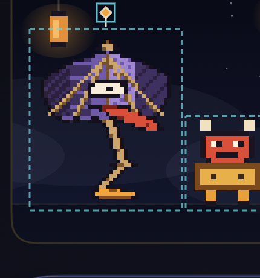
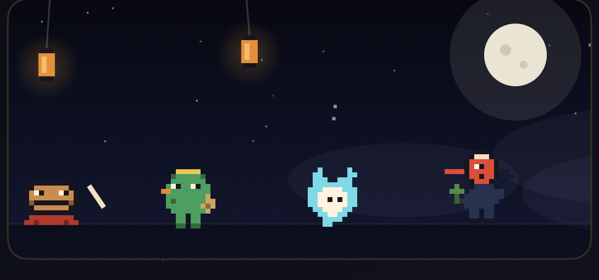

# Step 4 唐傘 Simulator evidence

> 状態: **ユーザー視覚承認待ち**。唐傘だけがSNES相当で、他妖怪は従来アートのmixed-artです。この状態を `main` へmergeしません。

iOS 26.5 Simulatorで取得した、Step 4「夜行絵巻 2.0」唐傘縦切りの確認画像です。

## 通常姿勢・先導marker

## quietProxy — hush姿勢

## strong + Reduce Motion

開いた静止姿勢と静的な破線輪郭です。

## strong + 丑三つ時

## 最小幅 iPhone 17e

390×844 pt、preview 355×159 ptでの表示です。

## 検証条件

- iPhone 17 Pro / iPhone 17e
- Xcode 26.6 / iOS 26.5
- Debug launch argument: `-step4-parade-preview`
- AXでscenario、resident、丑三つ時、Reduce Motionを確認
- build/testsの詳細は[implementation plan](../../superpowers/plans/2026-07-12-yagyo-emaki-2-karakasa-vertical-slice.md)を参照
