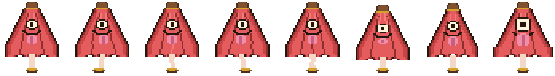
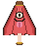
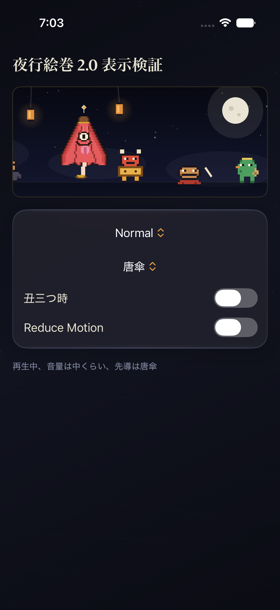
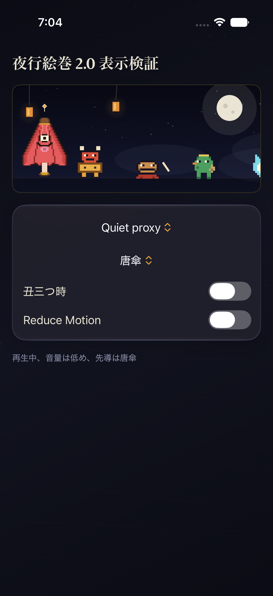
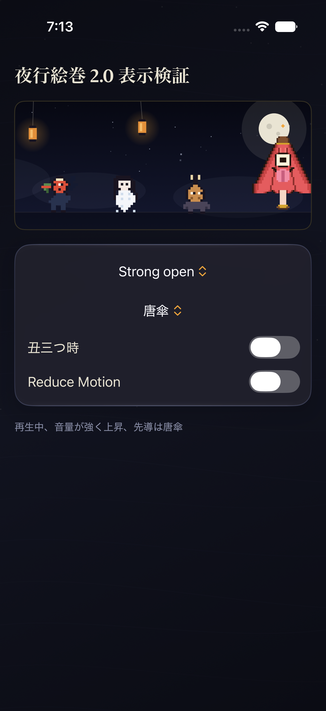
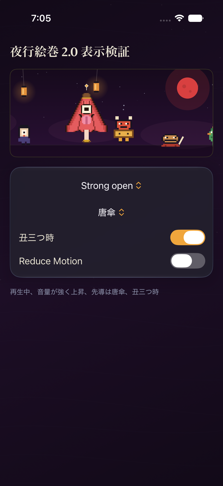
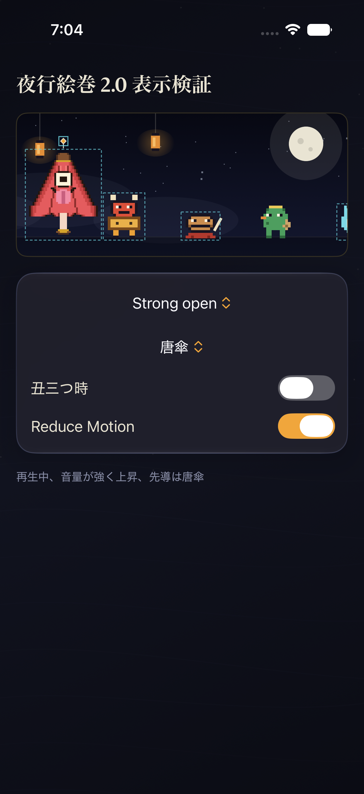
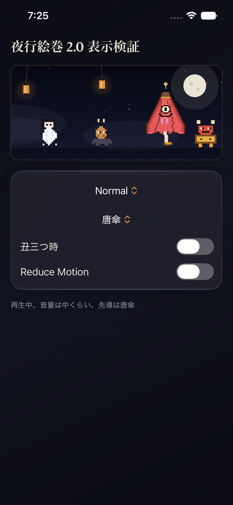

# Step 4 唐傘・現在の承認候補証跡

このフォルダは、参照忠実度再設計後の赤い正面向き唐傘だけを収める証跡ledgerです。生成対象commitは `d1eca866`。初期の紫色・横向き／長い柄・横に開いた唐傘と、その旧Simulator画像はsupersededであり、ここには置きません。

現在候補は40×48 px、`idle 1 + walk 4 + hush 1 + strong 2`の8フレームです。`.open`は互換性のための内部phase名で、画像上は横へ開いた傘ではなく正面reactionを表します。contact sheet／GIFとSimulator画像7枚は、2名の独立native reviewerがすべて**APPROVED**しました（BLOCKER／MAJOR／MINOR 0）。Pro Strongの右端寄りは切断なしのINFOだけです。ユーザー本人の見た目承認は**2026-07-12にPR #13のレビューで完了**しました。

参照仕様は[唐傘・参照忠実度再設計](../../superpowers/specs/2026-07-12-karakasa-reference-fidelity-redesign.md)、実行記録は[implementation plan](../../superpowers/plans/2026-07-12-karakasa-reference-fidelity-implementation.md)、振付の意味は[夜行絵巻 振付翻訳帳](../../CHOREOGRAPHY.md)を正本とします。

## 証跡一覧とSHA-256

| ファイル | 意味 | 寸法／フレーム | SHA-256 | 現在のQA状態 |
|---|---|---|---|---|
| [`karakasa-contact-sheet.png`](karakasa-contact-sheet.png) | 8 semantic frames | 696×96 PNG | `6f092b951f7ff42f6302d4fd34aed72778bd71539bc77cac4951619a5f2ac368` | independent native QA APPROVED |
| [`karakasa-motion-preview.gif`](karakasa-motion-preview.gif) | coherent motion preview | 80×96、15 frames | `4a3243ea3093c7a686bf8544034010976ab88f23df1c20fcd23806691e2bd50a` | independent native QA APPROVED |
| [`karakasa-normal-iphone17pro.png`](karakasa-normal-iphone17pro.png) | Normal + Karakasa | 1206×2622 PNG | `d3d0d8bc8ad560178c0d9cc65d0d6a6bd71ad63952aad729cad7226eda08a599` | semantic AX GREEN、native visual QA APPROVED |
| [`karakasa-quiet-iphone17pro.png`](karakasa-quiet-iphone17pro.png) | Quiet + Karakasa | 1206×2622 PNG | `619b6e3574321a08c1b0de1830061f6f99e230f9ee6caf71f782e84883d418af` | semantic AX GREEN、native visual QA APPROVED |
| [`karakasa-strong-iphone17pro.png`](karakasa-strong-iphone17pro.png) | Strong + Karakasa | 1206×2622 PNG | `b9c701999de044c506ab36af12ed31c48bbd386417dccecf01f212f9a47ebb15` | semantic AX GREEN、native visual QA APPROVED（right-edge INFO、not clipped） |
| [`karakasa-strong-ushimitsu-iphone17pro.png`](karakasa-strong-ushimitsu-iphone17pro.png) | Strong + Karakasa + Ushimitsu | 1206×2622 PNG | `65e3327ca498bdc6671cd1db4143aadb29a05bb6db59c5de38b71fb0cbb696e9` | semantic AX GREEN、native visual QA APPROVED |
| [`karakasa-strong-reduce-motion-iphone17pro.png`](karakasa-strong-reduce-motion-iphone17pro.png) | Strong + Karakasa + Reduce Motion、`t0` | 1206×2622 PNG | `54d997b10c157e6acc887f68b0072a93cc77bdbcefb7c8d8611957b995296335` | semantic AX GREEN、native visual QA APPROVED |
| [`karakasa-strong-reduce-motion-iphone17pro-t-plus-2s.png`](karakasa-strong-reduce-motion-iphone17pro-t-plus-2s.png) | 同状態、`t+2 s` | 1206×2622 PNG | `54d997b10c157e6acc887f68b0072a93cc77bdbcefb7c8d8611957b995296335` | full PNG identical、native visual QA APPROVED |
| [`karakasa-normal-iphone17e.png`](karakasa-normal-iphone17e.png) | 最小幅、Normal + Karakasa、selected `+6 s` | 1170×2532 PNG、1,616,447 bytes | `6a65cbce58404770515b7d737fff2ac11103ae495005638c40c8fcb1d3e09811` | semantic XCUITest GREEN、native visual QA APPROVED |

## 最新ASCIIから生成した8フレーム

semantic orderは次のとおりです。

1. `idle.closed`
2. `walk.contact`
3. `walk.rise`
4. `walk.cross`
5. `walk.settle`
6. `hush.crouch`
7. `strong.anticipate`
8. `strong.open`（互換名。視覚は正面reaction）

GIFは `idle, walk0...3, walk0...3, hush, hush, strong0, strong1, strong1, idle` の15フレームです。同じASCII sourceから2倍整数複製で生成し、補間、別version混在、compositing trailはありません。

## iPhone 17 Pro — semantic state evidence

| Normal | Quiet |
|---|---|
|  |  |

| Strong | Strong + Ushimitsu |
|---|---|
|  |  |

| Strong + Reduce Motion `t0` | Strong + Reduce Motion `t+2 s` |
|---|---|
|  |  |

## iPhone 17e — 最小幅evidence

採用画像はsemantic XCUITest成功後の`selected_offset = +6 s`です。状態はNormal + Karakasa、Ushimitsu 0、Reduce Motion 0、control interactionなし。機械判定では赤い連結成分が192×180 px、左／右／上／下marginが684／190／165／133 pxで、cream／dark／pink／brown／goldのidentity colorsをすべて含みます。

## 検証条件と結果

- Xcode 27.0、iOS 27、iPhone 17 Pro／iPhone 17e。
- generic iOS build: SUCCESS。
- checked project focused QA: **11 / 11 PASS、fail 0、skip 0**。
- checked project full suite: **65 / 65 PASS、fail 0、skip 0**。
- iPhone 17 Pro semantic AX state matrix: Normal、Quiet、Strong、Strong + Ushimitsuの **4 / 4 PASS、skip 0**。
- iPhone 17 Pro Reduce Motion stability: Strong + Reduce Motion **1 / 1 PASS、skip 0**。
- iPhone 17e semantic XCUITest: default Normal + Karakasa **1 PASS、fail 0、skip 0**。
- state selectionはAX element referenceだけで行い、座標tapは使用していません。
- Reduce Motionの`t0`／`t+2 s`はfull PNGのSHA-256が同一で、canvas cropのdiffering bytesも0です。

## 除外した試行

- 最初のiPhone 17e menu試行失敗は結果件数へ含めません。
- auto diagnostics終了はtest／visual結果へ含めません。
- 旧`+10 s`の17e画像（SHA-256 `87a7c6b43a538ab2b2c249f08e9f198d926d9adf886f8489b47118d6507ce727`）は、唐傘が行進で画面外だったためsupersededです。ファイルはこのledgerへ置かず、`+6 s`の完全表示画像だけを採用します。
- 正本結果は上記follow-up GREENと、表に記録した9 binary artifactsだけです。

## QAと公開ゲート

- contact sheet／GIF: 元参照と比較した独立native visual QA **APPROVED**。
- Simulator screenshots: semantic AX／XCUITestとhash検証はGREEN。2名の独立native visual QAは全7枚を**APPROVED**（BLOCKER／MAJOR／MINOR 0）。Pro Strongの右端寄りは切断なしのINFOのみ。
- ユーザー見た目承認: **2026-07-12、PR #13レビューで承認済み**（「唐傘のビジュアル承認します」）。
- GitHub binary evidence commit `150219fea8a13ed95ea65885f5e7b46101cff9e5`で9 binary blobのSHA-256と画像linkを確認済み。旧5画像は削除済み。
- [Draft PR #13](https://github.com/tinypony777/YagyoPlayer/pull/13)は本文更新済み、`draft = true`、`merged = false`、base `main`。
- `main` SHA `256a45a8c9d9efb8db09970f3e40e6d1f5ef28fc`は不変。
- （superseded）当時は唐傘だけが新画風のmixed-art状態でした。残り7体と一つ目小僧は[frame matrix仕様](../../superpowers/specs/2026-07-12-remaining-yokai-frame-matrix.md)に基づきPR #14で制作・承認・統合され、混在画風は解消済みです。証跡は[残り妖怪ledger](../step4-remaining-yokai/README.md)を参照。
