# Step 4 残り行列妖怪・現在の承認候補証跡

このフォルダは、[残り行列妖怪・frame matrix 仕様](../../superpowers/specs/2026-07-12-remaining-yokai-frame-matrix.md)に基づいて描き直した7体（鬼太鼓・木魚・河童・狐火・天狗・雪女・琵琶牧々）と一つ目小僧の証跡ledgerです。唐傘の証跡は[唐傘ledger](../step4-karakasa/README.md)を正本とし、ここには置きません。

全48フレームは40×48 px、透明を除き最大12色、共通の墨 `k = 0x24160f`、`anchorX = 20`、`baselineY = 45` を共有します。`hush` 専用姿勢は唐傘だけの契約のため、ここの妖怪は `idle 1 + walk 4`（strong を持つ鬼太鼓・木魚・狐火・天狗は `+ strong 2`）です。

## 生成方法

- 正本は各 `*Sprite.swift` の1文字=1ドット行文字列と限定パレット（`OniSprite.swift` ほか）。
- ここの contact sheet／motion preview は、同じASCIIソースから最近傍2倍・gap 8 pxで決定論的に生成した（Linux上のPythonレンダラー。補間・別version混在なし）。
- Mac側では `ParadeQAArtifactTests` が同じASCIIソースから同形式の contact sheet／motion preview をXCTAttachmentとして再生成できる。

## 証跡一覧とSHA-256

| ファイル | 意味 | 寸法／フレーム | SHA-256 |
|---|---|---|---|
| [`parade-lineup.png`](parade-lineup.png) | 行列9体(唐傘含む)のidle並置・画風一貫性レビュー対象、4倍表示 | 1536×192 PNG | `d7abd16b803059ed3f5be12184abf50d8f4dd2ba6c9da18e8bd6588b7a1cd3c0` |
| [`oni-contact-sheet.png`](oni-contact-sheet.png) | 鬼太鼓 7 semantic frames | 608×96 PNG | `bafb1fa8f669910f48d3ceef6750327afb04bf11d1a0c2c604e70f024e488eb7` |
| [`mokugyo-contact-sheet.png`](mokugyo-contact-sheet.png) | 木魚 7 semantic frames | 608×96 PNG | `7ff89e9b6f13140a198ad163f95482bdd6cc01638dcac8d7879379a08410fbf6` |
| [`kappa-contact-sheet.png`](kappa-contact-sheet.png) | 河童 5 semantic frames | 432×96 PNG | `5430c5f7744bbd7c1e19e9b7dbb50650793bba1374618f569af5df3a12c349d1` |
| [`kitsune-contact-sheet.png`](kitsune-contact-sheet.png) | 狐火 7 semantic frames | 608×96 PNG | `b67401e362fea771dedf1080538e7a1823c7231742020557c6d2578f21b0e894` |
| [`tengu-contact-sheet.png`](tengu-contact-sheet.png) | 天狗 7 semantic frames | 608×96 PNG | `7b5caa026c79f6669a84b98b27e185f9466c4ede9b893ebe8729e265a8f9fd23` |
| [`yuki-contact-sheet.png`](yuki-contact-sheet.png) | 雪女 5 semantic frames | 432×96 PNG | `5e734a447ed29e7aa5c3920a129f690ba4e0612b574bd735b42c2dd2f7159beb` |
| [`biwa-contact-sheet.png`](biwa-contact-sheet.png) | 琵琶牧々 5 semantic frames | 432×96 PNG | `a15e886a6f00833cbf28f413dc17171a3cdfc490bc3e9839fb558568d4261d35` |
| [`hitotsume-contact-sheet.png`](hitotsume-contact-sheet.png) | 一つ目小僧 5 semantic frames | 432×96 PNG | `a43f098904235ddb033b7655dfad15c85339787748984370eaaabb8bc06fea97` |
| [`oni-motion-preview.gif`](oni-motion-preview.gif) | 鬼太鼓 motion preview | 80×96、13 frames | `e9752c4cb2a76d456407f6d423e8ba4490cc97b3e6e9a88c7847e155cd56791e` |
| [`mokugyo-motion-preview.gif`](mokugyo-motion-preview.gif) | 木魚 motion preview | 80×96、13 frames | `8380a637015547cc655798d5edec53db84e0879646fcd14e8453876ca772fa88` |
| [`kappa-motion-preview.gif`](kappa-motion-preview.gif) | 河童 motion preview | 80×96、10 frames | `2badbe5500060d7ba683a2cf3f826ee843b45f271b6a8fd5b31dc2849bb5bf9b` |
| [`kitsune-motion-preview.gif`](kitsune-motion-preview.gif) | 狐火 motion preview | 80×96、13 frames | `1ffafcf318a22fa1214253797dd1f2c1f9da0d662c71e1ff6879bbcab20feffc` |
| [`tengu-motion-preview.gif`](tengu-motion-preview.gif) | 天狗 motion preview | 80×96、13 frames | `442c255f86bfe4a36b8ecb71c47cc2ce920eddcca156f9a1920b3ea991b95f03` |
| [`yuki-motion-preview.gif`](yuki-motion-preview.gif) | 雪女 motion preview | 80×96、10 frames | `7725bb4116cd8a7c9e752e500f1c82d67e63ce26b53ea2ec3f5c4f48f2b3cd08` |
| [`biwa-motion-preview.gif`](biwa-motion-preview.gif) | 琵琶牧々 motion preview | 80×96、10 frames | `95d9afa5d75906eebc3d5f9eeb1cfd451dea87d8ff8f966a0e35be4e1f378997` |
| [`hitotsume-motion-preview.gif`](hitotsume-motion-preview.gif) | 一つ目小僧 motion preview | 80×96、10 frames | `394c617acd934f5f0d44224703d355aa9a5eecfcb5d0a3855a1beabe7729e01f` |

GIFは `idle → walk×2周 →（strongがある妖怪は anticipate → reaction保持）→ idle` の構成で、`ParadeQAArtifactTests.motionTimeline` と同じ並びです。

## 行列全体（唐傘含む）

[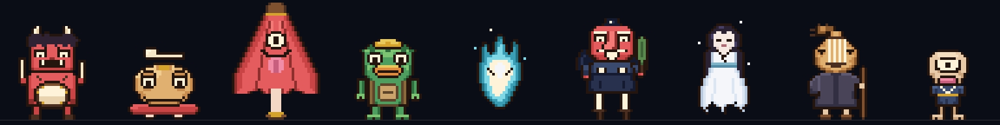](parade-lineup.png)

並び順は 鬼太鼓・木魚・唐傘・河童・狐火・天狗・雪女・琵琶牧々・一つ目小僧。唐傘が最大、一つ目小僧が最小で、浮遊は狐火（4 px＋火の粉）と雪女（2 px＋裾の霞・雪粒）だけです。

## 各妖怪の semantic frames

| 鬼太鼓 | 木魚 |
|---|---|
|  |  |

| 河童 | 狐火 |
|---|---|
| [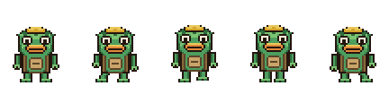](kappa-contact-sheet.png) | [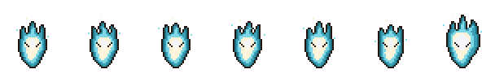](kitsune-contact-sheet.png) |

| 天狗 | 雪女 |
|---|---|
|  |  |

| 琵琶牧々 | 一つ目小僧 |
|---|---|
| [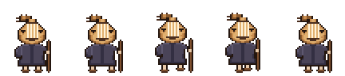](biwa-contact-sheet.png) | [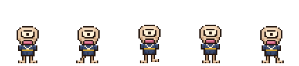](hitotsume-contact-sheet.png) |

semantic order は各シートとも `idle, walk.contact, walk.rise, walk.cross, walk.settle` に、strong を持つ妖怪は `strong.anticipate, strong.<strike|flare|hit>` が続きます。

## Simulator evidence

ユーザー環境のMacで、決定論的な `ParadePreviewHarness` により状態を固定して取得したSimulator画像です。ローカルXcodeのbooted runtimeがiOS 26.5のため、PR本文の記述にあるiOS 27.0ではなくiOS 26.5での撮影です。

| ファイル | 状態 | Simulator | 寸法 | SHA-256 |
|---|---|---|---:|---|
| [`pr14-simulator-iphone-17-pro-max-normal.png`](pr14-simulator-iphone-17-pro-max-normal.png) | Normal | iPhone 17 Pro Max, iOS 26.5 | 1320×2868 | `893887eea9dc7ee93dbce25e35350afba6be611fe3ca376297883578fd7fdf13` |
| [`pr14-simulator-iphone-17-pro-max-quiet-proxy.png`](pr14-simulator-iphone-17-pro-max-quiet-proxy.png) | Quiet proxy(全妖怪 `idle` fallback) | iPhone 17 Pro Max, iOS 26.5 | 1320×2868 | `0dfc6cfd5c06d4e6dad4329bee2ab446ac0670bbce83eb1cd5325e16f2332cd8` |
| [`pr14-simulator-iphone-17-pro-max-strong-open.png`](pr14-simulator-iphone-17-pro-max-strong-open.png) | Strong open | iPhone 17 Pro Max, iOS 26.5 | 1320×2868 | `d0cc6ecc6a4b55335793ef9ec0195b79ba99c5b90372e4b45b2f9d35a5106ae7` |
| [`pr14-simulator-iphone-17-pro-max-strong-ushimitsu.png`](pr14-simulator-iphone-17-pro-max-strong-ushimitsu.png) | Strong + Ushimitsu | iPhone 17 Pro Max, iOS 26.5 | 1320×2868 | `e1da0ca2c1ab7bf4a7cb1354eb4f8073fa30d04e93f87c0758a2fe60ea140256` |
| [`pr14-simulator-iphone-17-pro-max-strong-reduce-motion.png`](pr14-simulator-iphone-17-pro-max-strong-reduce-motion.png) | Strong + Reduce Motion, `t0` | iPhone 17 Pro Max, iOS 26.5 | 1320×2868 | `1b4d50604c29ad43baf4c6032c5add57f23d07aa42e7f5d435b407796f09a73b` |
| [`pr14-simulator-iphone-17-pro-max-strong-reduce-motion-t-plus-2s.png`](pr14-simulator-iphone-17-pro-max-strong-reduce-motion-t-plus-2s.png) | 同状態、`t+2 s` | iPhone 17 Pro Max, iOS 26.5 | 1320×2868 | `6ce77da80bf7058354289b79bbd7c5470b1119afd6a80a0549f968384c44f447` |
| [`pr14-simulator-iphone-17e-normal.png`](pr14-simulator-iphone-17e-normal.png) | 最小幅 Normal | iPhone 17e, iOS 26.5 | 1170×2532 | `b4b9f18aa4c9ab4456198f4562fbbc2501474ad0389151dae8f427d4f9a7c94a` |

| Normal | Quiet proxy |
|---|---|
| [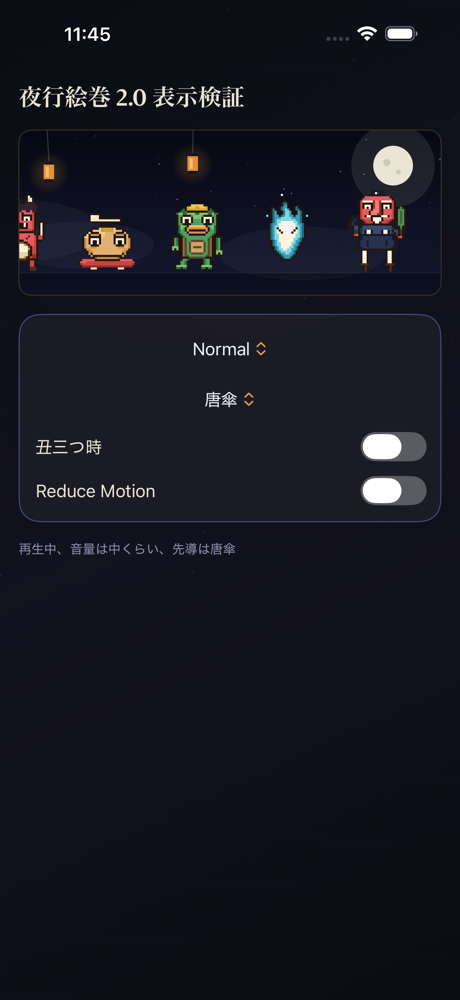](pr14-simulator-iphone-17-pro-max-normal.png) | [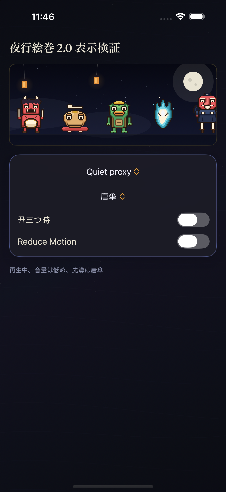](pr14-simulator-iphone-17-pro-max-quiet-proxy.png) |

| Strong open | Strong + Ushimitsu |
|---|---|
| [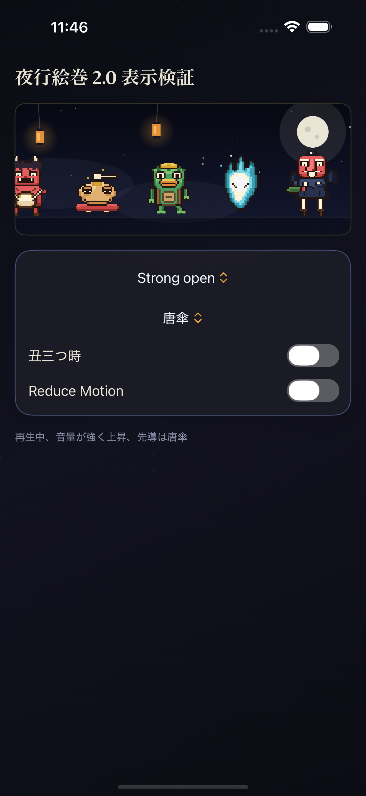](pr14-simulator-iphone-17-pro-max-strong-open.png) | [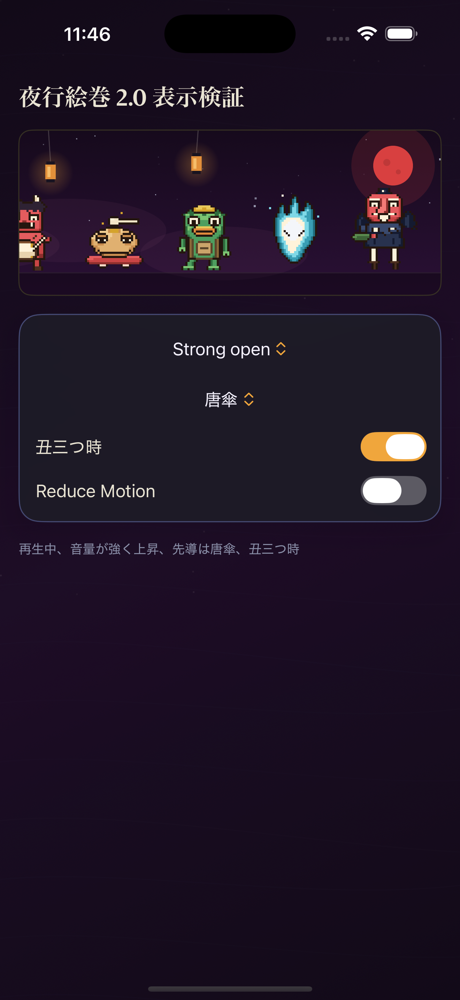](pr14-simulator-iphone-17-pro-max-strong-ushimitsu.png) |

| Strong + Reduce Motion `t0` | iPhone 17e Normal |
|---|---|
| [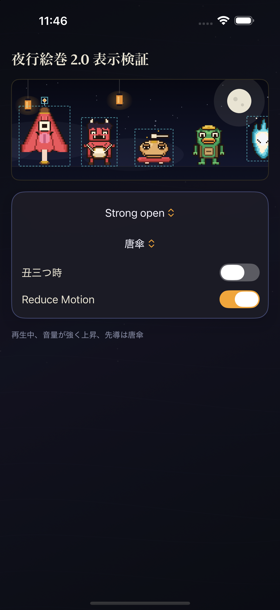](pr14-simulator-iphone-17-pro-max-strong-reduce-motion.png) | [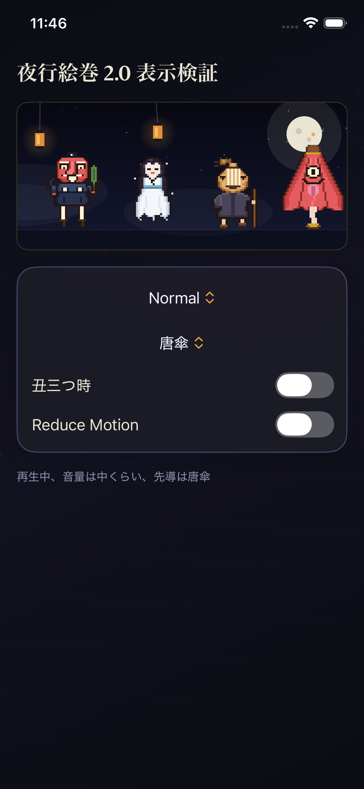](pr14-simulator-iphone-17e-normal.png) |

### Reduce Motion `t0`／`t+2 s` の機械検証

唐傘ledgerと異なり、full PNGのSHA-256は同一**ではありません**。ピクセル差分を機械計測した結果は次のとおりです。

- 夜行絵巻canvasのスプライト描画領域(y = 372...837)は**差分0バイト**で完全一致。位置・姿勢・輪郭・先導灯はすべて静止している。
- 差分は (1) canvas最下段の境界線行と直下のハーネスUI(コントロールパネル)に散る**単一チャンネル±1/255**の合成ノイズ(最大チャンネル和差2、知覚不能)、(2) 画面最下部のscroll indicatorのフェード残り、の2種のみ。
- したがってReduce Motionの静止契約(スプライトの位置とscaleが時刻に依らず一致)は満たしている。full PNG同一ではない理由は行列表示の外側にある。

### 目視QA(取得画像に対する検収)

- 全状態で混在画風なし。行列は9体すべて新40×48契約で、旧8bitスプライトは現れない。
- Strong系: 反応するのは唐傘・鬼太鼓(太鼓打ち+金の光)・木魚(バチ+squash)・狐火(flare)・天狗(羽団扇hit)のみ。河童・雪女・琵琶牧々・一つ目小僧は反応しない(契約どおり)。
- Reduce Motion + Strong: 破線輪郭はstrongフレームを持つ妖怪だけに出て、透明余白ではなく本体bboxにフィットする。先導灯(唐傘resident)は頭頂に密着。
- Quiet proxy: 全妖怪が `idle` fallback。
- 最小幅iPhone 17e: 天狗・雪女・琵琶牧々・唐傘を確認、切れ・補間・衝突なし。

## QA状態

- **構造検証:** 8体×全48フレームが共通契約（キャンバス、色数、余白、接地または浮遊帯、中心整合、walk／strongドリフト制限、承認パレット完全一致）をPASS。同じ契約を `ParadeSpriteContractTests` がXcode側で恒久化する。
- **独立視覚QA:** 制作エージェントとは別の2レンズ（identity契約／frame family一貫性）のレビュアーが各妖怪をAPPROVED。天狗のみ修復1回を経てAPPROVED、他はブロッカー0。
- **画風一貫性:** 唐傘を基準に9体のlineupを独立レビューし、墨の使い方・ランプ彩度・顔の意匠・相対サイズ・接地整合で外れ値なし（coherent判定）。
- **Simulator検証:** ユーザー環境のMac(iOS 26.5 runtime)で通常・quiet・strong・丑三つ時・Reduce Motion(t0/t+2s)・最小幅の7枚を取得済み。スプライト描画領域のReduce Motion差分0バイトと、上記の目視QA項目を確認した。
- **未完了:** ユーザー本人の見た目承認。これが済むまで視覚完了・`main` 統合とはしません。
