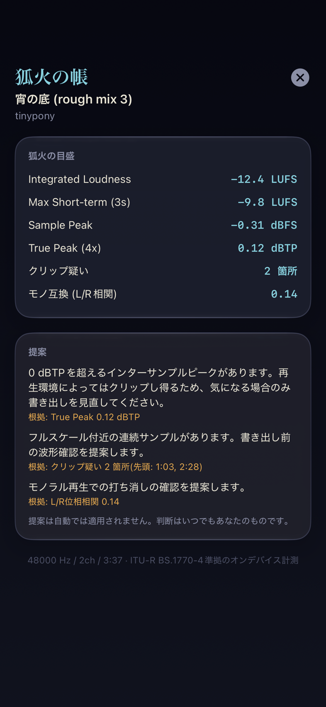
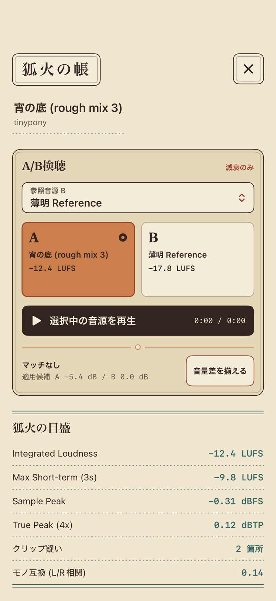
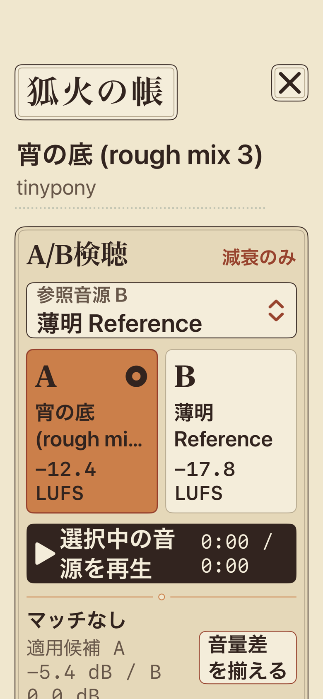

# Step 5 狐火の帳 Phase A/B・証跡ledger

[設計仕様](../../superpowers/specs/2026-07-12-kitsunebi-no-tobari-design.md)のPhase A(一画面検聴)とPhase B(A/B参照)の証跡です。

## 実装

- `KitsunebiAnalyzer` / `KitsunebiAnalyzerEngine`: [Mastering-App](https://github.com/tinypony777/Mastering-App)(commit `73e21fa`)の `KWeightingFilter` / `LUFSMeter` / `TruePeakMeter` / `AudioAnalyzer` のstreaming手法を移植し、仕様の補修2点+レビュー由来の補修を適用した1パスchunked解析。
  - 補修1: Short-term(3秒)も100msホップ30本のリングでstreaming化。サンプル数に比例するバッファは持たない(Integratedのゲーティングにのみ100msあたり1つのブロックラウドネス値を保持する)。
  - 補修2: クリップ疑いを「|x| ≥ 0.999 が3サンプル以上連続するラン」の回数+開始位置(開始時刻の小さい8件・昇順)へ。ランはチャンク境界を越えて追跡する。
  - レビュー補修A: **非48kHzのK-weighting係数式を移植元のRBJ cookbook近似からDe Man系のパラメータ化(pyloudnormと同一)へ差し替え**。旧式は44.1kHzでEBU基準信号が-20.246 LUFS(許容±0.1の外)だった。新式はsr=48000を代入すると公式Table 1/2を機械精度で再現する。
  - レビュー補修B: **非有限値の遮断**。+inf/NaNを含む壊れたfloat音源でも、Sample Peak / True Peak / 相関が非有限のままJSONへ到達しない(nil=計測不能へ)。旧実装ではlibrary.jsonの保存が以後すべて失敗し得た。
  - レビュー補修C: チャンネル重みの決め打ち(index 3=LFE)を撤去。多チャンネルは**チャンネルラベル**(タグ/ビットマップはAudioToolboxで展開)からBS.1770の重みを導く: ブースト帯|方位角|60°〜120°(±110 Ls/Rs・±90 SL/SR・±60 Lw/Rw)=1.41、±135リア=1.0、LFE除外 — libebur128の写像と一致。MPEG/AAC/AudioUnit等どのタグ順序でも正しく載り、**ラベル不明時は等重みでチャンネルを落とさない**。モノ互換の相関も実際のL/Rラベルの位置で計算する(例: C,L,R,…配置ではch1×ch2)。
- `TobariMetrics`: `contentHash` + `analyzerVersion` キーの検聴キャッシュ(library.json後方互換、無限大はnilで表現)。保存失敗時はメモリ上もロールバック(他の編集系と同じ不変条件)。
  - 設計note: 仕様§6の`AnalysisStore`は独立コンポーネントではなく、`AudioTrack.tobariMetrics`への保存+同一`contentHash`の共有照合(`sharedTobariMetrics`)で実現した。重複取込された同一音源は再解析しない。
- `TobariView` / `TobariAnalysisController`: トラック長押し→「狐火の帳で検聴」で開く一画面。解析・hash backfill(SHA-256のファイル全読み)ともに低優先度のバックグラウンドタスクで、メインスレッドを塞がない。進捗・失敗を明示し再生へ影響しない。帳を閉じても解析は完走し、キャッシュ保存まで済ませる(途中中断で結果を捨てない)。hash backfill不能時はキャッシュせず表示のみ。VoiceOverはタイトル一式が1要素、閉じるボタンは独立フォーカス、目盛は行ごとに結合。

## Phase B — A/B参照と減衰のみのラウドネスマッチ

- `TobariABComparisonView`: 帳の対象をA、ライブラリから選ぶ参照音源をBとして表示する。再生中の切替では同じ経過時刻を引き継ぎ、A/B札のワンタップで比較できる。参照の解析には既存`TobariAnalysisController`と`TobariMetrics`キャッシュを再利用し、別の解析器・別cacheを作らない。
- `TobariLoudnessMatch`: 両方のIntegrated Loudnessが有限のときだけ、小さい側のLUFSをtargetにして大きい側を減衰する。両側のgainは常に0 dB以下で、線形乗数も`0...1`。無音・未解析・非有限値では推測せず「マッチなし」にする。
- `PlaybackController.loudnessMatchMultiplier`: ユーザーの基準音量`volume`とは別の非永続乗数。`AVAudioPlayer`へ渡す値は`volume × loudnessMatchMultiplier`で、マッチ解除は乗数を1へ戻すだけ。参照変更、通常のtrack load(同一IDの再読込と読込失敗を含む)、削除stop、帳を閉じる操作で解除される。一時停止は同じ比較を再開できるよう保持する。
- A/B切替は`AVAudioPlayer.currentTime`をその場で読み、公開用15 Hz時刻ではなくbackendの実時刻を引き継ぐ。選択中のA/B以外が再生されている場合はmatch操作を無効化し、別トラックへ比較用gainを適用しない。
- UIは初期状態を「マッチなし」とし、作者の明示操作でだけ適用する。適用候補／適用中のA/B両gainを常時dB表示し、「マッチなしへ」を同じ面に置く。柿色は選択と操作、青緑は従来どおり解析値だけに限定する。
- ローカルの`DSP_Reference/`は別アプリのSwift DSP実装一式として監査した。Phase Bでは`RealtimePreviewEngine`の「基準音量と別の出力gain」という境界だけを現行設計へ照合し、Mastering用chain、独立LUFS実装、UI、リアルタイムcallbackを移植していない。productionのラウドネス値は現行`KitsunebiAnalyzer`へ一本化したままである。

Phase Bは再生render callbackへ処理を追加しない。ゲイン計算はユーザー操作時のMainActor上で一度だけ行い、既存`AVAudioPlayer.volume`へ有限の乗数を反映する。波形更新の15 Hz経路、Audio Session、Now Playing、`ParadeSignalCoordinator`には変更を加えていない。

## アルゴリズム検証(Python参照ミラー)

Swift実装と同一の係数式・ゲーティング・FIR設計を [`mirror.py`](mirror.py) に1:1で写像し、既知信号の期待値を導出した。`KitsunebiAnalyzerTests` はこの値を固定する。

| 信号 | 期待値(ミラー実測) | 意味 |
|---|---|---|
| 997 Hz正弦波 ステレオ -20 dBFS 10s @48k | Integrated **-20.000 LUFS** / Max ST -20.000 / Sample Peak -20.00 dBFS / True Peak -20.00 dBTP / 相関 +1.0 | EBU Tech 3341の基準系と一致(K-weightingの+0.691 dB@997Hzと-0.691オフセットが相殺) |
| 同上 @44.1k | Integrated **-19.997 LUFS**(許容±0.1内) | 係数式ブランチの規格適合。残差0.003は双一次変換の周波数歪みでpyloudnormと同一 |
| 無音 3s | 全指標 計測不能(nil) | 無限大をJSONへ書かない契約 |
| 1 kHzフルスケール方形波 1s @48k | Sample Peak 0.00 dBFS / True Peak **+1.848 dBTP** / クリップ疑い1ラン(0:00) / Integrated +0.825 LUFS | 帯域制限補間のオーバーシュートとクリップ検出 |
| 997 Hz逆相ステレオ 5s @48k | 相関 **-1.0** / Integrated -6.021 LUFS | モノ互換の検出。位相はラウドネスへ影響しない |
| fs/4正弦波 位相π/4 1s @48k | Sample Peak -9.031 dBFS / True Peak **-6.159 dBTP** | インターサンプルピーク(標本値に隠れた真のピーク)。理想-6.021への僅かな未達は48タップFIRの設計どおり |

このほか、チャンク分割不変性(3001サンプル刻み vs 一括)、チャンク境界を跨ぐクリップランの追跡、キャッシュ契約(版・hash・自身のhash欠落)、モノラルと計測不能の表示区別をテストで固定している。

## レビュー

- 独立レビューエージェント4体(DSP正当性 / Swift 6コンパイル安全性 / テスト妥当性 / 統合・仕様適合)+GitHub上のCopilot・Codexレビューを実施。
- 採用した主な指摘: 非有限値の遮断(DSP/統合の両レビューが独立に検出)、44.1kHz係数式の規格不適合(テストレビューが数値導出込みで検出)、hash backfillのメインスレッド実行(Copilot/Codex)、チャンネル重みの決め打ち(Codex)、閉じるボタンのVoiceOver独立性、重複トラックのキャッシュ共有、保存失敗時のロールバック。
- Swift 6 strict concurrencyの実コンパイルエラー1件(`[weak self]`のmutable束縛を@Sendableクロージャが参照)はMac上のXcodeビルドで検出し、強参照キャプチャへ変更(帳を閉じても解析を完走させる設計と整合)。

## Mac側検証(Desktop Commander経由・2026-07-12)

- **full suite 100 / 100 成功**(Xcode 27.0 / iPhone 17 Pro Simulator)。`KitsunebiAnalyzerTests` 16 / 16 を含み、ミラー導出の期待値(EBU -20 LUFS、True Peakオーバーシュート、44.1kHz適合、チャンク不変性、クリップラン境界)、チャンネルレイアウト解決(5.1タグ/ビットマップ)、ファイル経由E2E(Float32 CAF書き→`analyze(url:)`→EBU値一致+進捗単調増加)が実際のAccelerate / AVFoundation / AudioToolbox上で成立した。
- Xcode Cloud「Build - iOS」はgreen。初回コミット(`8ccfeda`)のCI失敗はMac上のビルドで「`[weak self]`のmutable束縛を@Sendableクロージャが参照」というSwift 6エラーと特定し、強参照キャプチャで解消した。

## 帳の画面(Simulator実描画)

`testExportsTobariScreenArtifact` がSimulatorの実ウィンドウで描画・撮影した一画面(提案3種がすべて出る代表値)。ImageRendererはScrollView内容を描かず、素のUIWindowはシーン未接続で真っ白になるため、windowScene接続+drawHierarchy方式で撮り、「ほぼ単色なら失敗」の機械検証をテストに組み込んだ。

Phase BはA/B札、参照選択、再生、候補gainを先に読める位置へ置いた。標準402×874 ptと、390×844 pt・Dynamic Type Accessibility 2の双方を同じ実ウィンドウ経路で撮影した。

| 標準 | Accessibility 2 |
|---|---|
|  |  |

- `tobari-phase-b.png`: SHA-256 `91341bdd4305374653a5f14db63e178458b2f35e47dc4b5c14ec3fe5e994cbd5`
- `tobari-phase-b-accessibility-large.png`: SHA-256 `4acb31097229f58328af7f80d7943d6c03e2df3d55422beaa680290482868b64`
- iPhone 17 Pro / iOS 26.5の最終focused run: `TobariLoudnessMatchTests` 5、`PlaybackControllerTests` 19、実描画1の計 **25 / 25 PASS**。比較対象外trackの遮断、同一ID再読込／読込失敗時の解除、backend実時刻、極端な有限値、一時停止とtrue stopの境界を含む。xcresultは外付けSSDの`/Volumes/MacBook_Data_Add/CodexDerivedData/YagyoPlayer/dsp-phase-b-review-fixes-20260713/focused.xcresult`。
- reviewで見つかった「track load開始時に旧playerのmatchを先に解除すると、file初期化中だけ旧音源が基準音量へ跳ねる」経路は、旧playerを先にpauseしてから解除する順序へ修正した。再生中の別track切替／同一track再読込／読込失敗を含むfocused runは **24 / 24 PASS**。xcresultは同SSDの`/Volumes/MacBook_Data_Add/CodexDerivedData/YagyoPlayer/dsp-phase-b-review-comment-green-20260713/focused.xcresult`。
- iPhone 17 Pro / iOS 26.5の全回帰は **139 / 139 PASS、failure 0、skip 0**。解析、再生、取込、行列、巻物、3タブと全実描画artifactを含む。最終xcresultは外付けSSDの`/Volumes/MacBook_Data_Add/CodexDerivedData/YagyoPlayer/dsp-phase-b-review-final-full-20260713/full.xcresult`。
- ネイティブ再監査は **Blocker 0 / Major 0**。対象track境界、player/UI同期、切替位置、数値防御、一時停止／true stopの5契約と、render callbackへ処理を増やしていないことを確認した。独立focused runも **24 / 24 PASS**、`git diff --check` PASS。xcresultは同SSDの`/Volumes/MacBook_Data_Add/CodexDerivedData/YagyoPlayer/dsp-phase-b-reaudit/DerivedData/Logs/Test/Test-YagyoPlayer-2026.07.13_23-04-43-+0900.xcresult`。
- iPhone 17 Pro Max / iOS 27.0実機は、同SSDの`dsp-phase-b-device-20260713/device-build.xcresult`で署名付きDebug build PASS、署名検証PASS、ワイヤレス上書きinstall PASS。端末ロック中だったためCodexからの自動launchだけ未確認で、インストール自体は完了している。

## 完了記録

- 2026-07-12: ユーザー本人がiPhone実機で動作確認し、PR #16を承認(「実機確認しました。マージ承認します。」)。`main`へ統合し、**Phase A完了**。
- 実機確認の過程で見つかった2件(行の再生ボタンが頭出しになる問題、フィルタ行のPickerラベルが曲リストへ重なる問題)も同PRで修正済み(巻物側の行と再生文脈の引き継ぎを含む)。
- 2026-07-13: True Peakの提案を**0 dBTP超のみ**へ変更(作者判断)。ロスレス再生は0 dBTPまで問題なく、配信プラットフォームはノーマライズ時にTrue Peak側も補正するため、-1.0 dBTPの余裕確認はマスター段階で不要。文言も「気になる場合のみ書き出しを見直す」へ改め、上の実描画を新文言(代表値TP +0.12)で更新。
- 2026-07-13: Phase Bを現行`main`から実装。A/B、減衰専用match、別乗数、解除境界、標準／Accessibility実描画、実機へのワイヤレスinstallまでfeature branchで確認。ユーザーの実機操作確認とPR統合は未完了。
