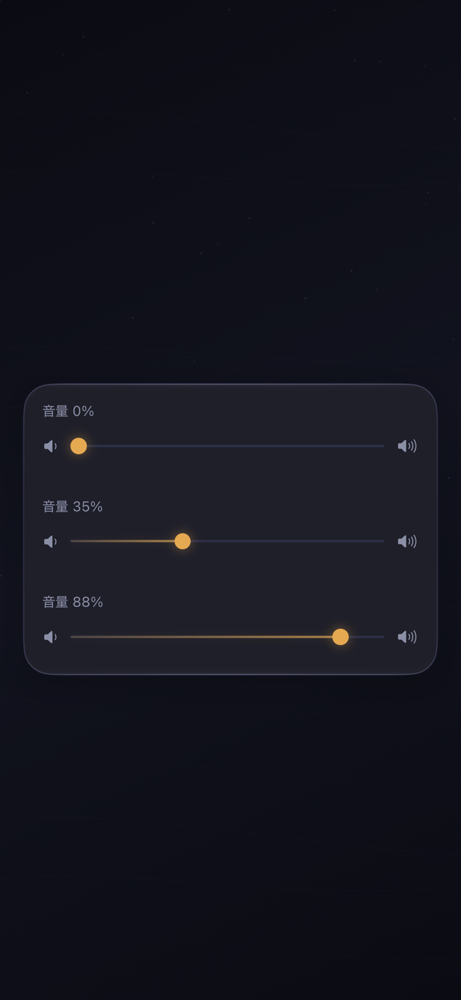
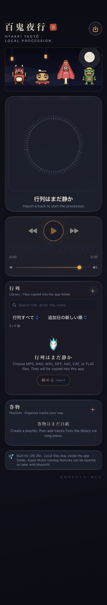
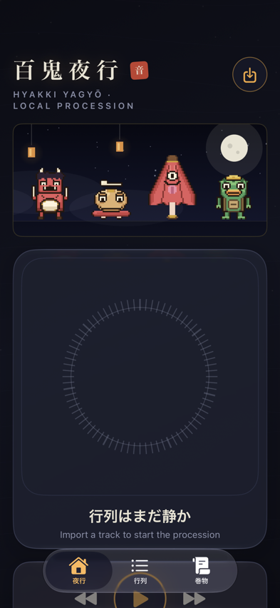
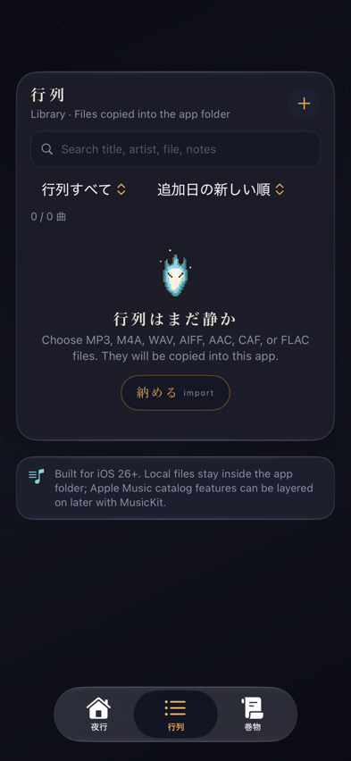
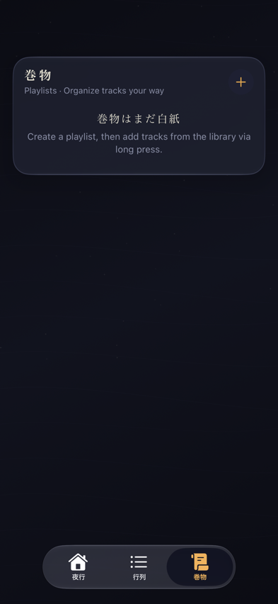
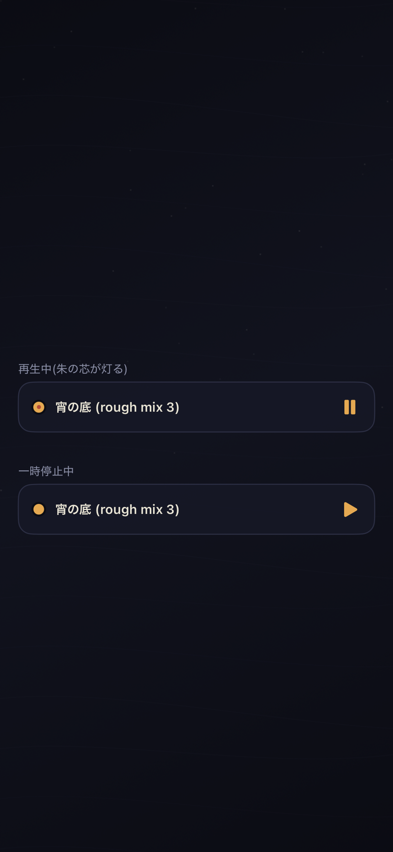

# UI改善「夜行の間取りと灯り」証跡ledger

[設計仕様](../../superpowers/specs/2026-07-12-yagyo-madori-to-akari-design.md)(PR #18で承認)の導入順序に沿った証跡です。

## Step 1: 灯芯スライダー(仕様§4.1)

音量の標準 `Slider`(白い丸ノブ+狐火色tint)を、`StepProgressBar` と同族の自前ビュー `TomoshibiSlider` へ置換。

- **意匠**: 明治大正の計器を思わせる「罫と丸紋」(オーナーのモダンレトロ指向フィードバックを受け、3案の実描画比較からB案を選定)。単罫+四半目盛のトラック、通過側は提灯色のフラットな実線、ノブは丸紋(提灯色+墨の輪+朱の芯)。グラデーション・ソフトglowは不使用。ドラッグ中は朱の芯がわずかに広がり、Reduce Motion時は変化しない。
- **実装**: `VisualComponents.swift`(StepProgressBarと同居)。タップ位置ジャンプ+ドラッグ(最小距離8ptはStepProgressBarと同じ)。位置→値はノブ可動域 [r, width−r] の逆写像で、表示と操作が同一写像(Copilot/Codex指摘対応)。VoiceOverは `.adjustable`(%読み上げ、一歩5%)。
- **置換箇所**: `ContentView.swift` の音量行のみ。両端のスピーカーアイコン、`volumeBinding`、`PlaybackController` は不変。
- **テスト**: `TomoshibiSliderTests` — 位置→値の写像とクランプ(4)+ノブ中心が左右端で0/1へ写る回帰(2)、VoiceOver増減とクランプ(4)、Simulator実描画のQA artifact(2、単色検知つき)。TDD(RED: `Cannot find 'TomoshibiSlider' in scope` → GREEN、写像修正もRED 0.07/0.93 → GREEN)で追加。

### Simulator実描画(iPhone 17 Pro / iOS 27.0)

代表値0% / 35% / 88%(ContentViewと同じ音量行構成):

実ContentView統合後の全景(空ライブラリ、音量は既定0.88):

## Step 2: タブ分け(仕様§4.2)

一枚の縦長スクロールを、承認済みの推奨案「3タブ+ミニ灯り」へ分割。

- **間取り**: ネイティブ `TabView`(tint=提灯色)で 夜行(house)/行列(list.bullet)/巻物(scroll)。夜行=ヘッダ・絵巻・円形波形・再生操作・音量、行列=検索・スコープ・並び替え・曲リスト・取込(+PlatformNote)、巻物=巻物一覧。ヘッダの取込ボタンは初回起動(空ライブラリで夜行に着地)のため残した(仕様の「実装時に見た目で判断」)。
- **ミニ灯り**: 行列/巻物タブの下部(`safeAreaInset`)に、現在曲がある間だけ出る小さなバー。曲名+再生/一時停止(同一曲toggleの原則)+タップで夜行タブへ。意匠は灯芯と同じ「罫と丸紋」の文法(フラット塗り、再生中は丸紋に朱の芯が灯る)。
- **不変**: `AudioLibraryStore`/`PlaybackController`はノータッチ。帳・札直し・削除確認のsheetと共存規則、fileImporter・alert類・URLルーティング(continueLastTrackで夜行タブへ)もContentView据え置き。
- **テスト**: `YagyoTabTests` — タブ順・表題・アイコン・ミニ灯り表示規則(TDD: `cannot find 'YagyoTab' in scope` のRED→GREEN)+実描画QA artifact 4本(3タブ+ミニ灯り2状態、単色検知つき)。

### Simulator実描画(iPhone 17 Pro / iOS 27.0)

| 夜行 | 行列 | 巻物 |
|---|---|---|
|  |  |  |

ミニ灯り(再生中=朱の芯が灯る/一時停止=芯消灯):

