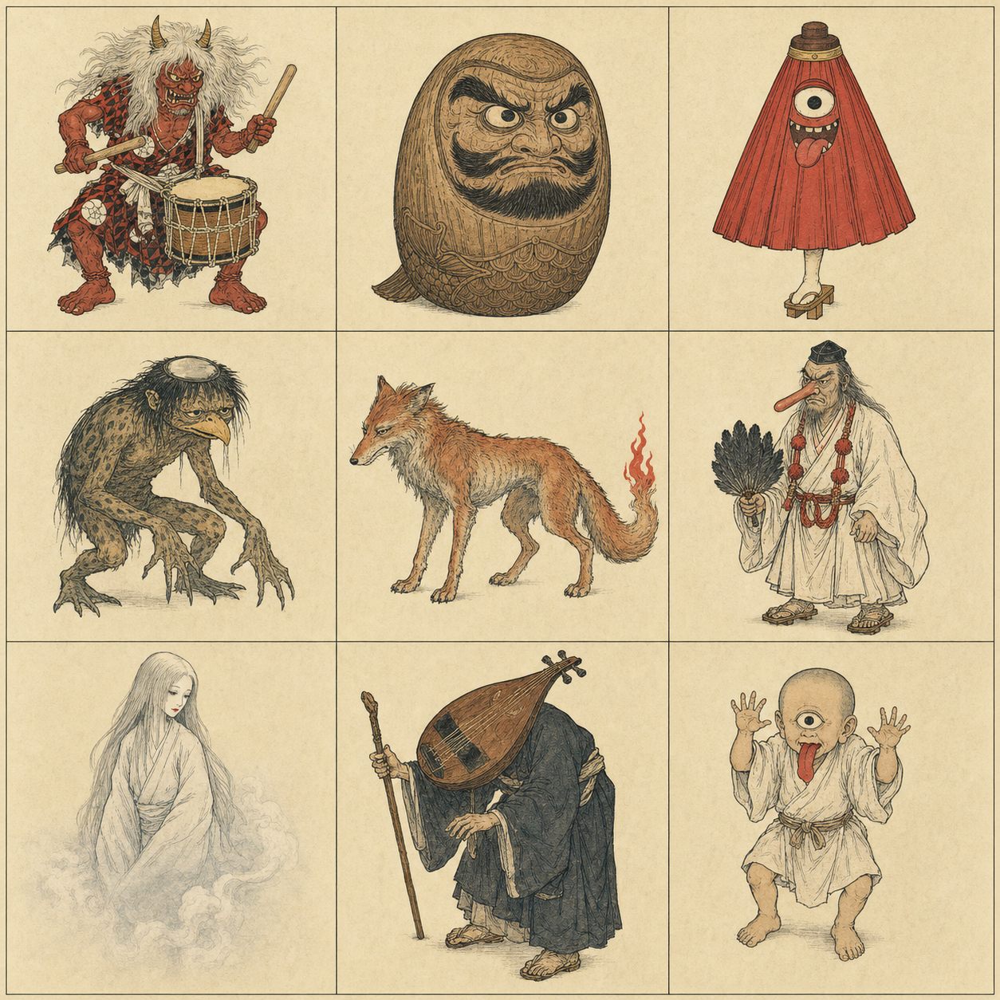
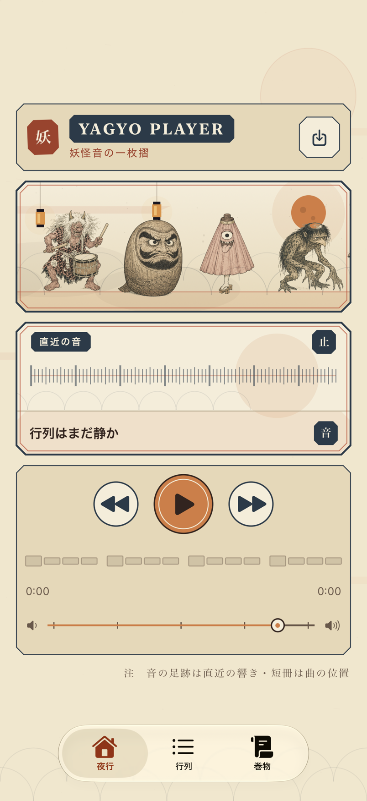
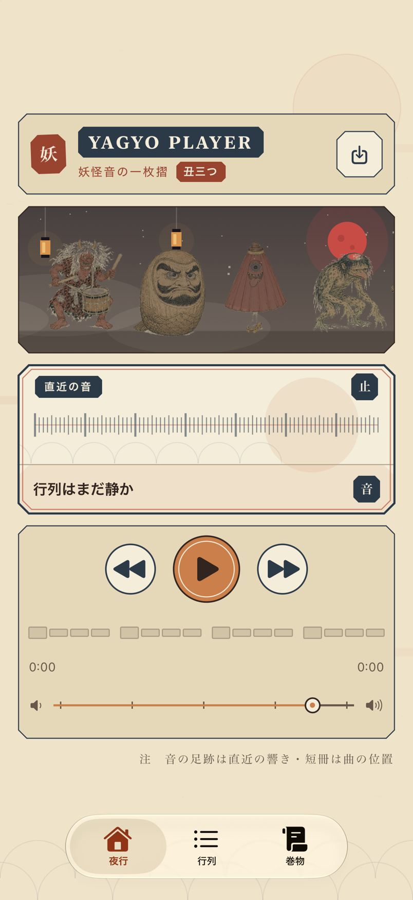
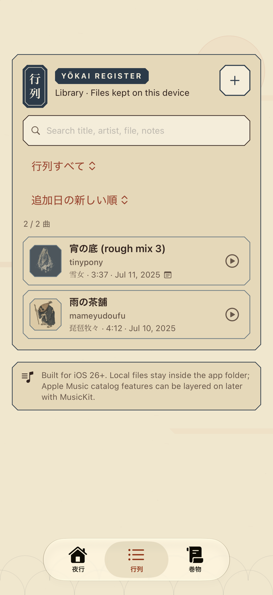
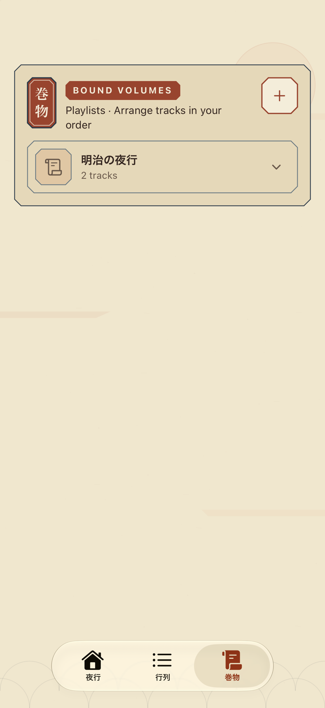
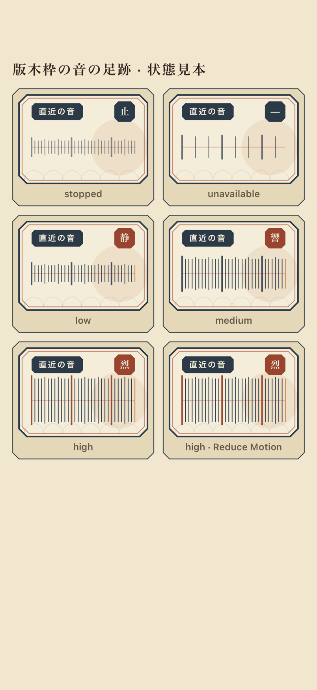
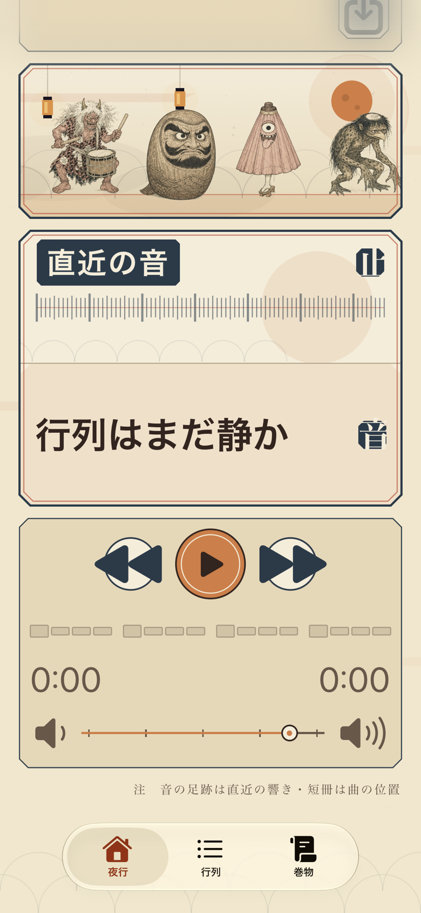
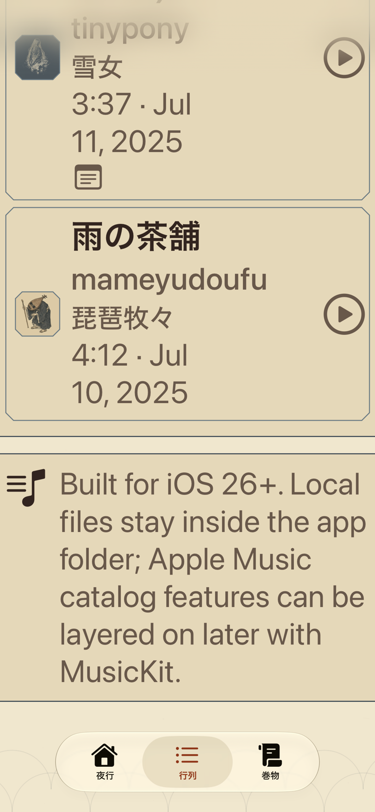

# 妖怪 × 浮世絵 × モダンレトロ — 実描画証跡

- 日付: 2026-07-15
- 仕様: [一枚摺の番付 UI 設計](../../superpowers/specs/2026-07-15-yokai-ukiyoe-modern-retro-redesign.md)
- 視覚ゲート: 9体の `neutral idle` 比較板をユーザー本人が「OK承認します」と承認
- 対象: 夜行、行列、巻物、横長の音の足跡、木版妖怪9体

## 承認正本と実装方法

比較板の9体を、描き直さず機械的に個別の透過PNGへ分離してAsset Catalogへ収録した。各個体を別プロンプトで再生成していないため、承認された等身、線密度、限定色、造形差をそのまま共通base artとして使う。

- resident IDと並び順は既存契約を維持する。
- 歩行は既存の水平移動とbob、静音・強反応は同じbase artのscale／offset／opacityから派生する。
- 静音・強反応を持つ妖怪の範囲は旧pixel実装のmatrixを維持する。
- Reduce Motionでは時間依存の移動とbobを止め、対象妖怪だけ静的輪郭を出す。
- Asset Catalogから正本が欠損した場合は、既存pixel実装へ戻る。
- 442px PNGのalpha bboxを全画素走査するテストで、接地、住人印、静的輪郭の基準を固定する。
- 博物館、図書館、妖怪データベースのReference画像は造形確認だけに使い、アプリへ複製収録していない。

旧pixel正本は40×48の互換fallbackとして残す。承認済み木版PNGは正方形正本を歪めない64×64の配置座標へ置き、実描画では透明領域を除くalpha bboxで接地させる。これは新しい低解像度ピクセル化ではなく、442×442の透過ラスターを表示するための座標系である。

## 最終画面

| 夜行 Day | 夜行 丑三つ時 |
|---|---|
|  |  |

| 行列 | 巻物 |
|---|---|
|  |  |

| 横長の音の足跡 | 承認済み9体 |
|---|---|
|  |  |

Dayは生成り紙を基本面とし、欄間、横長可視化、操作、native tab barを一枚摺の罫線体系へ揃えた。丑三つ時は妖怪欄間だけを温かい煤茶へ暮らし、本文と音表示はDayのまま維持する。雪女の曲札だけは紙色の線を失わないよう、小さな藍摺の守り神印へ載せる。

## Accessibility Dynamic Type

| 夜行・下端 | 行列・下端 |
|---|---|
|  |  |

Accessibility 3では縦ScrollViewへfallbackする。下端まで実際にscrollしたartifactで、夜行の再生操作と灯芯、行列の最終曲と欄外注記がnative tab barの上まで到達できることを確認した。

## 自動検証

DerivedData、`xcresult`、一時生成物はすべて外付けSSDの `/Volumes/MacBook_Data_Add/CodexDerivedData/YagyoPlayer/` 以下へ生成し、SSD未接続時の内蔵ディスクfallbackは行わない。

- 木版アセット読込、resident順、alpha bbox、状態matrix: PASS
- Day／丑三つ時／行列／巻物／Accessibility下端artifact: PASS
- stopped／unavailable／low／medium／high／Reduce Motionの横長表示: PASS
- 独立native Swift監査: P0 0、P1 0、P2 0
- iOS 27 Simulator focused regression: 50 tests、0 failures
- iOS 27 Simulator non-playback suite: 200 tests、0 failures
- Release generic iOS build: PASS
- iPhone 17 Pro Max 署名付きDebug build／wireless install: PASS

全235件のSimulator実行では、既存の `PlaybackBackendSeamTests`／`PlaybackControllerTests` に入るとAudio Session初期化後にtest hostが終了し、Xcodeが各testを再起動し続けた。iOS 27とiOS 26.5の双方で同じ挙動で、今回変更したUI／アセット／waveform／解析を含む残り200件はiOS 27で完走している。再生系35件は実機testへ切り替えて最終確認する。

実機へのアプリ本体installは完了。launchは端末ロック中にSpringBoardから拒否されたため、ロック解除後に再実行して結果を追記する。

## 境界

この変更は表示専用で、再生backend、DSP、A/B、ラウドネスマッチ、Music Understanding、取込、削除、queue、URL routingを変更しない。全曲peak/RMS waveformと追加のoffline解析は別phaseとする。
